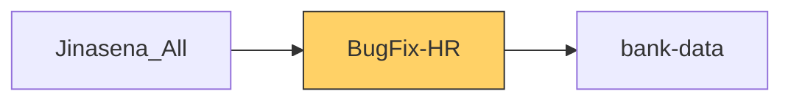

# Functional Documentation — BugFix-HR

> Generated by `scripts/generate_functional_docs.py` from branch `Visual_Migration_02` (commit 7d18f2c 2026-10-06) and the installed module on the clean environment. For every attribute: **Function** = what it does, **Depends on** = the attributes it relies on (owning module in brackets when it is not this repo), **Used by** = the attributes in any Jinasena repo that rely on it.

| Item | Value |
|---|---|
| Technical name | `BugFix-HR` |
| Title | Jinasena : Module : HR |
| Version | `17.0.0.0.48` |
| Category | Human Resources |
| License | LGPL-3 |
| Installed on environment | installed 17.0.0.0.48 |
| History | [CHANGELOG.md](CHANGELOG.md) |

## Purpose

<!-- SUMMARY:repo -->
BugFix-HR is the Jinasena module that carries the company's Human Resources customisations, ported from Odoo Studio into Python and XML. It is used by HR, recruitment, attendance and payroll staff: recruiters, line managers and leadership score job applicants; attendance officers approve overtime; payroll users keep the PAYE tax table and record statutory data (EPF, ETF, occupation and purpose codes) that BugFix-Accounting reads onto journal items.

- Recruitment scoring on applicants: line manager, leadership and recruiter decisions and marks, each editable only by the assigned user, a computed Total Marks, mark validations and stage automations.
- Overtime approval: the Update OT document loads open attendances for a date, lets users tick Approve OT and marks the attendances as OT approved.
- Payroll configuration: the Paye Tax table (date range, value band and tax amount) with tags, plus Rules, ETF Schedule and Bank Data menus.
- Employee and contract data: EPF/ETF numbers, occupation and purpose codes, OT and employee rates, initials, surname, occupation grade and yearly benefit amounts.
- Form and list tweaks on attendance, expenses, job positions, payslip bank data and recruitment stages.
- Ported access rights and record rules for HR, recruitment, attendance, expense and payroll models.
<!-- /SUMMARY -->

## Module dependencies

| Kind | Modules |
|---|---|
| Odoo standard / enterprise | `base_setup`, `hr`, `hr_attendance`, `hr_contract`, `hr_expense`, `hr_payroll`, `hr_recruitment`, `base_automation` |
| Jinasena repos | `bank-data` |
| Third-party apps |  |
| Used by (Jinasena repos that depend on this one) | `Jinasena_All` |



## Contents at a glance

| Attribute type | Count |
|---|---|
| Models created | 4 |
| Models extended | 15 |
| Fields | 157 |
| Python methods | 6 |
| Views | 26 |
| Window actions | 15 |
| Server actions | 24 |
| Automations | 11 |
| Menus | 6 |
| Access rights | 19 |
| Record rules | 21 |

## Models

| Model | Description | Created / extends | Fields | Views | Actions + automations | Approvals |
|---|---|---|---|---|---|---|
| `hr.applicant` | Applicant | extends (hr_recruitment) | 15 | 1 | 20 | 0 |
| `hr.attendance` | Attendance | extends (hr_attendance) | 7 | 1 | 0 | 0 |
| `hr.attendance.overtime` | Attendance Overtime | extends (hr_attendance) | 0 | 0 | 0 | 0 |
| `hr.contract` | Employee Contract | extends (hr_contract) | 21 | 1 | 0 | 0 |
| `hr.employee` | Employee | extends (hr) | 10 | 2 | 0 | 0 |
| `hr.expense` | Expense | extends (hr_expense) | 0 | 1 | 0 | 0 |
| `hr.expense.sheet` | Expense Report | extends (hr_expense) | 0 | 0 | 0 | 0 |
| `hr.job` | Job Position | extends (hr) | 5 | 1 | 0 | 0 |
| `hr.payroll.structure` | Salary Structure | extends (hr_payroll) | 0 | 0 | 0 | 0 |
| `hr.payslip` | Pay Slip | extends (hr_payroll) | 0 | 1 | 0 | 0 |
| `hr.payslip.run` | Payslip Batches | extends (hr_payroll) | 0 | 0 | 0 | 0 |
| `hr.recruitment.stage` | Recruitment Stages | extends (hr_recruitment) | 1 | 1 | 0 | 0 |
| `hr.salary.attachment` | Salary Attachment | extends (hr_payroll) | 0 | 0 | 0 | 0 |
| `hr.salary.rule` | Salary Rule | extends (hr_payroll) | 0 | 0 | 0 | 0 |
| `hr.work.entry.report` | Work Entries Analysis Report | extends (hr_payroll) | 0 | 0 | 0 | 0 |
| `x_paye_tax` | Paye Tax | created | 40 | 4 | 3 | 0 |
| `x_paye_tax_tag` | Paye Tax Tags | created | 8 | 3 | 0 | 0 |
| `x_update_ot` | Update OT | created | 36 | 4 | 12 | 0 |
| `x_update_ot_line_7eea7` | Update Ot  Lines | created | 14 | 6 | 0 | 0 |

### `hr.applicant` — Applicant

*Extends a model created by `hr_recruitment`.* Python: `models/hr_applicant.py`.

**Summary:**

<!-- SUMMARY:model:hr.applicant -->
Adds a three-party scoring workflow to the applicant form: Recruiter, Line Manager Name and Leadership Name users, Line Manager and Leadership Yes/No selections, and four mark percentages that are each editable only by the assigned user (via computed current-user flags). Total Marks is computed and stored as the sum of the four marks. Automations reject marks above 100, move the applicant to stage id 1 when the line manager says No, write stage id 0 when leadership says Yes (which clears the stage), and block users from applicants in stages not listed in their allowed recruitment stages. The standard Recruiter field is hidden, and the repo ships the global rule HR - RR on applicants, which has an empty domain and therefore does not filter any records.
<!-- /SUMMARY -->

**Fields (15):**

| Field | Label | Type | Function | How it gets its value | Depends on | Used by |
|---|---|---|---|---|---|---|
| `x_studio_2nd_selection` | Leadership Selection | selection: Yes=Yes; No=No | Leadership's decision on the applicant (Yes / No), editable only by the assigned Leadership user. An automation writes stage id 0 (clears the stage) when it is set to Yes. | stored |  | `automation BugFix-HR.base_automation_263_hr_applicant_2`<br>`server action BugFix-HR.sa_f5_hr_applicant_hr_applicant_2`<br>`server action BugFix-HR.server_action_2580_hr_applicant_2`<br>`view BugFix-HR.ported_view_5550_hr_applicant_form` |
| `x_studio_appreciation` | Application | selection: Normal=Normal; Low=Low; High=High; Very High=Very High | Manual rating of the application (Normal / Low / High / Very High); not shown in any view or used by any logic in this repo. | stored |  |  |
| `x_studio_cu_leadership` | CU - Leadership | boolean | Computed flag, True when the logged-in user is the applicant's Leadership Name; hidden on the form and used to make the leadership selection and marks read-only for everyone else. | computed by `_compute_cu_leadership`; not stored | `hr.applicant._compute_cu_leadership()` | `hr.applicant._compute_cu_leadership()`<br>`view BugFix-HR.ported_view_5550_hr_applicant_form` |
| `x_studio_cu_line_manager` | CU - Line Manager | boolean | Computed flag, True when the logged-in user is the applicant's Line Manager Name; hidden on the form and used to make the line manager selection and marks read-only for everyone else. | computed by `_compute_cu_line_manager`; not stored | `hr.applicant._compute_cu_line_manager()` | `hr.applicant._compute_cu_line_manager()`<br>`view BugFix-HR.ported_view_5550_hr_applicant_form` |
| `x_studio_cu_recruiter` | CU - Recruiter | boolean | Computed flag, True when the logged-in user is the applicant's Recruiter; hidden on the form and used to make the assignment and recruiter marks read-only for everyone else. | computed by `_compute_cu_recruiter`; not stored | `hr.applicant._compute_cu_recruiter()` | `hr.applicant._compute_cu_recruiter()`<br>`view BugFix-HR.ported_view_5550_hr_applicant_form` |
| `x_studio_hr_responsible` | HR Responsible | many2one → `hr.employee` | Employee responsible in HR for the applicant; entered manually, not shown in any view or used by any logic in this repo. | stored | `model hr.employee` (hr) |  |
| `x_studio_interview_marks_1` | Line Manager Marks % | integer | Line manager's interview mark in percent, editable only by the assigned Line Manager; has an ir.default value, an automation rejects values above 100, and it is added into Total Marks. | stored |  | `automation BugFix-HR.base_automation_265_hr_validate_line_manager_marks`<br>`default BugFix-HR.default_432_hr_applicant_x_studio_interview_marks_1`<br>`hr.applicant._compute_total_marks()`<br>`server action BugFix-HR.sa_f5_hr_applicant_hr_validate_line_manager_marks`<br>`server action BugFix-HR.server_action_2582_hr_validate_line_manager_marks`<details><summary>+1 more</summary>`view BugFix-HR.ported_view_5550_hr_applicant_form`</details> |
| `x_studio_interview_marks_2` | Leadership Marks % | integer | Leadership interview mark in percent, editable only by the assigned Leadership user; has an ir.default value, an automation rejects values above 100, and it is added into Total Marks. | stored |  | `automation BugFix-HR.base_automation_266_hr_validate_leadership_marks`<br>`default BugFix-HR.default_433_hr_applicant_x_studio_interview_marks_2`<br>`hr.applicant._compute_total_marks()`<br>`server action BugFix-HR.sa_f5_hr_applicant_hr_validate_leadership_marks`<br>`server action BugFix-HR.server_action_2583_hr_validate_leadership_marks`<details><summary>+1 more</summary>`view BugFix-HR.ported_view_5550_hr_applicant_form`</details> |
| `x_studio_interview_marks_3` | Recruiter Marks % | integer | Recruiter's interview mark in percent, editable only by the assigned Recruiter; has an ir.default value, an automation rejects values above 100, and it is added into Total Marks. | stored |  | `automation BugFix-HR.base_automation_264_hr_validate_recruiter_marks`<br>`default BugFix-HR.default_434_hr_applicant_x_studio_interview_marks_3`<br>`hr.applicant._compute_total_marks()`<br>`server action BugFix-HR.sa_f5_hr_applicant_hr_validate_recruiter_marks`<br>`server action BugFix-HR.server_action_2581_hr_validate_recruiter_marks`<details><summary>+1 more</summary>`view BugFix-HR.ported_view_5550_hr_applicant_form`</details> |
| `x_studio_leadership_name` | Leadership Name | many2one → `res.users` | User acting as leadership reviewer for the applicant, chosen on the applicant form; only this user may edit the leadership selection and marks (via CU - Leadership). | stored | `model res.users` (base) | `hr.applicant._compute_cu_leadership()`<br>`view BugFix-HR.ported_view_5550_hr_applicant_form` |
| `x_studio_line_manager_name` | Line Manager Name | many2one → `res.users` | User acting as line manager for the applicant, chosen on the applicant form; only this user may edit the line manager selection and marks (via CU - Line Manager). | stored | `model res.users` (base) | `hr.applicant._compute_cu_line_manager()`<br>`view BugFix-HR.ported_view_5550_hr_applicant_form` |
| `x_studio_marks_1` | Recruiter Assignment Marks % | integer | Recruiter's assignment mark in percent, editable only by the assigned Recruiter; has an ir.default value, an automation rejects values above 100, and it is added into Total Marks. | stored |  | `automation BugFix-HR.base_automation_267_hr_validate_assignment_marks`<br>`default BugFix-HR.default_431_hr_applicant_x_studio_marks_1`<br>`hr.applicant._compute_total_marks()`<br>`server action BugFix-HR.sa_f5_hr_applicant_hr_validate_assignment_marks`<br>`server action BugFix-HR.server_action_2584_hr_validate_assignment_marks`<details><summary>+1 more</summary>`view BugFix-HR.ported_view_5550_hr_applicant_form`</details> |
| `x_studio_priority` | Line Manager Selection | selection: Yes=Yes; May Be=May Be; No=No | Line manager's decision on the applicant (Yes / May Be / No), editable only by the assigned Line Manager. An automation moves the applicant to the recruitment stage with id 1 when it is set to No. | stored |  | `automation BugFix-HR.base_automation_262_hr_applicant`<br>`server action BugFix-HR.sa_f5_hr_applicant_hr_applicant`<br>`server action BugFix-HR.server_action_2579_hr_applicant`<br>`view BugFix-HR.ported_view_5550_hr_applicant_form` |
| `x_studio_recruiter` | Recruiter | many2one → `res.users` | User acting as recruiter for the applicant, chosen on the applicant form; only this user may edit the assignment and recruiter marks (via CU - Recruiter). | stored | `model res.users` (base) | `hr.applicant._compute_cu_recruiter()`<br>`view BugFix-HR.ported_view_5550_hr_applicant_form` |
| `x_studio_total_marks` | Total Marks | float | Sum of the four mark percentages (assignment, line manager, leadership, recruiter), computed automatically; shown read-only as a progress bar on the applicant form. | computed by `_compute_total_marks`; stored | `hr.applicant._compute_total_marks()` | `hr.applicant._compute_total_marks()`<br>`view BugFix-HR.ported_view_5550_hr_applicant_form` |

**Python methods (4):**

| Method | Function | Decorators | Extends standard | Depends on | Used by | Where |
|---|---|---|---|---|---|---|
| `_compute_cu_line_manager` | Compute for CU - Line Manager: sets it True when the current user is the applicant's Line Manager Name; re-runs when the line manager changes. | api.depends('x_studio_line_manager_name') |  | `hr.applicant.x_studio_cu_line_manager`<br>`hr.applicant.x_studio_line_manager_name` | `hr.applicant.x_studio_cu_line_manager` | `models/hr_applicant.py:55` |
| `_compute_cu_leadership` | Compute for CU - Leadership: sets it True when the current user is the applicant's Leadership Name; re-runs when that user changes. | api.depends('x_studio_leadership_name') |  | `hr.applicant.x_studio_cu_leadership`<br>`hr.applicant.x_studio_leadership_name` | `hr.applicant.x_studio_cu_leadership` | `models/hr_applicant.py:61` |
| `_compute_cu_recruiter` | Compute for CU - Recruiter: sets it True when the current user is the applicant's Recruiter; re-runs when the recruiter changes. | api.depends('x_studio_recruiter') |  | `hr.applicant.x_studio_cu_recruiter`<br>`hr.applicant.x_studio_recruiter` | `hr.applicant.x_studio_cu_recruiter` | `models/hr_applicant.py:67` |
| `_compute_total_marks` | Compute for Total Marks: adds the assignment, line manager, leadership and recruiter mark percentages (empty values count as 0). | api.depends('x_studio_marks_1', 'x_studio_interview_marks_1', 'x_studio_intervie… |  | `hr.applicant.x_studio_interview_marks_1`<br>`hr.applicant.x_studio_interview_marks_2`<br>`hr.applicant.x_studio_interview_marks_3`<br>`hr.applicant.x_studio_marks_1`<br>`hr.applicant.x_studio_total_marks` | `hr.applicant.x_studio_total_marks` | `models/hr_applicant.py:74` |

**Server actions (13):**

- **Execute Code** (`server_action_2579_hr_applicant`, type `code`)
  - Function: Code run by the 'HR - Applicant' automation: if Line Manager Selection is No, moves the applicant to the recruitment stage with id 1 (hard-coded).
  - Depends on: `hr.applicant.x_studio_priority`, `model hr.applicant` (hr_recruitment)
  - Used by: `automation BugFix-HR.base_automation_262_hr_applicant`
  <details><summary>code (3 lines)</summary>

```python

if record.x_studio_priority == 'No':
  record['stage_id'] = 1
```
  </details>
- **Execute Code** (`server_action_2580_hr_applicant_2`, type `code`)
  - Function: Code run by the 'HR - Applicant 2' automation: if Leadership Selection is Yes, writes stage id 0, which clears the applicant's stage (likely unintended).
  - Depends on: `hr.applicant.x_studio_2nd_selection`, `model hr.applicant` (hr_recruitment)
  - Used by: `automation BugFix-HR.base_automation_263_hr_applicant_2`
  <details><summary>code (3 lines)</summary>

```python

if record.x_studio_2nd_selection == 'Yes':
  record['stage_id'] = 0
```
  </details>
- **Execute Code** (`server_action_2581_hr_validate_recruiter_marks`, type `code`)
  - Function: Code run by an automation: raises an error when Recruiter Marks % is above 100.
  - Depends on: `hr.applicant.x_studio_interview_marks_3`, `model hr.applicant` (hr_recruitment)
  - Used by: `automation BugFix-HR.base_automation_264_hr_validate_recruiter_marks`
  <details><summary>code (3 lines)</summary>

```python

if record.x_studio_interview_marks_3 > 100.00:
  raise UserError("Recruiter Marks should be Less than or Equls to 100.")
```
  </details>
- **Execute Code** (`server_action_2582_hr_validate_line_manager_marks`, type `code`)
  - Function: Code run by an automation: raises an error when Line Manager Marks % is above 100.
  - Depends on: `hr.applicant.x_studio_interview_marks_1`, `model hr.applicant` (hr_recruitment)
  - Used by: `automation BugFix-HR.base_automation_265_hr_validate_line_manager_marks`
  <details><summary>code (3 lines)</summary>

```python

if record.x_studio_interview_marks_1 > 100.00:
  raise UserError("Line Manager Marks should be Less than or Equls to 100.")
```
  </details>
- **Execute Code** (`server_action_2583_hr_validate_leadership_marks`, type `code`)
  - Function: Code run by an automation: raises an error when Leadership Marks % is above 100.
  - Depends on: `hr.applicant.x_studio_interview_marks_2`, `model hr.applicant` (hr_recruitment)
  - Used by: `automation BugFix-HR.base_automation_266_hr_validate_leadership_marks`
  <details><summary>code (3 lines)</summary>

```python

if record.x_studio_interview_marks_2 > 100.00:
  raise UserError("Leadership Marks should be Less than or Equls to 100.")
```
  </details>
- **Execute Code** (`server_action_2584_hr_validate_assignment_marks`, type `code`)
  - Function: Code run by an automation: raises an error when Recruiter Assignment Marks % is above 100.
  - Depends on: `hr.applicant.x_studio_marks_1`, `model hr.applicant` (hr_recruitment)
  - Used by: `automation BugFix-HR.base_automation_267_hr_validate_assignment_marks`
  <details><summary>code (3 lines)</summary>

```python

if record.x_studio_marks_1 > 100.0:
   raise UserError("Assignment Marks should be Less than or Equls to 100.")
```
  </details>
- **HR - Applicant** (`sa_f5_hr_applicant_hr_applicant`, type `code`)
  - Function: If Line Manager Selection is No, moves the applicant to the recruitment stage with database id 1 (hard-coded).
  - Depends on: `hr.applicant.x_studio_priority`, `model hr.applicant` (hr_recruitment)
  - Used by: — (not linked to a button, menu or automation)
  <details><summary>code (2 lines)</summary>

```python
if record.x_studio_priority == 'No':
  record['stage_id'] = 1
```
  </details>
- **HR - Applicant 2** (`sa_f5_hr_applicant_hr_applicant_2`, type `code`)
  - Function: If Leadership Selection is Yes, writes stage id 0 on the applicant, which clears the stage (hard-coded id; likely unintended).
  - Depends on: `hr.applicant.x_studio_2nd_selection`, `model hr.applicant` (hr_recruitment)
  - Used by: — (not linked to a button, menu or automation)
  <details><summary>code (2 lines)</summary>

```python
if record.x_studio_2nd_selection == 'Yes':
  record['stage_id'] = 0
```
  </details>
- **HR - Validate Assignment Marks** (`sa_f5_hr_applicant_hr_validate_assignment_marks`, type `code`)
  - Function: Raises an error when Recruiter Assignment Marks % is above 100.
  - Depends on: `hr.applicant.x_studio_marks_1`, `model hr.applicant` (hr_recruitment)
  - Used by: — (not linked to a button, menu or automation)
  <details><summary>code (2 lines)</summary>

```python
if record.x_studio_marks_1 > 100.0:
   raise UserError("Assignment Marks should be Less than or Equls to 100.")
```
  </details>
- **HR - Validate Leadership Marks** (`sa_f5_hr_applicant_hr_validate_leadership_marks`, type `code`)
  - Function: Raises an error when Leadership Marks % is above 100.
  - Depends on: `hr.applicant.x_studio_interview_marks_2`, `model hr.applicant` (hr_recruitment)
  - Used by: — (not linked to a button, menu or automation)
  <details><summary>code (2 lines)</summary>

```python
if record.x_studio_interview_marks_2 > 100.00:
  raise UserError("Leadership Marks should be Less than or Equls to 100.")
```
  </details>
- **HR - Validate Line Manager Marks** (`sa_f5_hr_applicant_hr_validate_line_manager_marks`, type `code`)
  - Function: Raises an error when Line Manager Marks % is above 100.
  - Depends on: `hr.applicant.x_studio_interview_marks_1`, `model hr.applicant` (hr_recruitment)
  - Used by: — (not linked to a button, menu or automation)
  <details><summary>code (2 lines)</summary>

```python
if record.x_studio_interview_marks_1 > 100.00:
  raise UserError("Line Manager Marks should be Less than or Equls to 100.")
```
  </details>
- **HR - Validate Recruiter Marks** (`sa_f5_hr_applicant_hr_validate_recruiter_marks`, type `code`)
  - Function: Raises an error when Recruiter Marks % is above 100.
  - Depends on: `hr.applicant.x_studio_interview_marks_3`, `model hr.applicant` (hr_recruitment)
  - Used by: — (not linked to a button, menu or automation)
  <details><summary>code (2 lines)</summary>

```python
if record.x_studio_interview_marks_3 > 100.00:
  raise UserError("Recruiter Marks should be Less than or Equls to 100.")
```
  </details>
- **HR - Validate Stages** (`server_action_1522_hr_validate_stages`, type `code`)
  - Function: Run by an automation on applicants outside stage id 1: unless the current user (or user id 1) has the applicant's stage in their allowed recruitment stages, raises 'Current User is Restricted to the Selected Stage.'
  - Depends on: `hr.applicant.stage_id` (hr_recruitment), `model hr.applicant` (hr_recruitment), `model res.users` (base)
  - Used by: `automation BugFix-HR.base_automation_93_hr_validate_stages`
  <details><summary>code (5 lines)</summary>

```python
if record.stage_id.id != 1:
  valid_user = env['res.users'].search([('id', '=', (uid,1)),('x_studio_recr_stages', '=', record.stage_id.id)])

  if not valid_user:
     raise UserError('Current User is Restricted to the Selected Stage.')
```
  </details>
**Automations (7):**

| Name | Record name | State | Function | Depends on | Used by |
|---|---|---|---|---|---|
| HR - Applicant | `base_automation_262_hr_applicant` |  | When a watched field changes in the form on Applicant, runs _Execute Code_. | `hr.applicant.x_studio_priority`<br>`model hr.applicant` (hr_recruitment)<br>`server action BugFix-HR.server_action_2579_hr_applicant` |  |
| HR - Applicant 2 | `base_automation_263_hr_applicant_2` |  | When a watched field changes in the form on Applicant, runs _Execute Code_. | `hr.applicant.x_studio_2nd_selection`<br>`model hr.applicant` (hr_recruitment)<br>`server action BugFix-HR.server_action_2580_hr_applicant_2` |  |
| HR - Validate Assignment Marks | `base_automation_267_hr_validate_assignment_marks` |  | When a watched field changes in the form on Applicant, runs _Execute Code_. | `hr.applicant.x_studio_marks_1`<br>`model hr.applicant` (hr_recruitment)<br>`server action BugFix-HR.server_action_2584_hr_validate_assignment_marks` |  |
| HR - Validate Leadership Marks | `base_automation_266_hr_validate_leadership_marks` |  | When a watched field changes in the form on Applicant, runs _Execute Code_. | `hr.applicant.x_studio_interview_marks_2`<br>`model hr.applicant` (hr_recruitment)<br>`server action BugFix-HR.server_action_2583_hr_validate_leadership_marks` |  |
| HR - Validate Line Manager Marks | `base_automation_265_hr_validate_line_manager_marks` |  | When a watched field changes in the form on Applicant, runs _Execute Code_. | `hr.applicant.x_studio_interview_marks_1`<br>`model hr.applicant` (hr_recruitment)<br>`server action BugFix-HR.server_action_2582_hr_validate_line_manager_marks` |  |
| HR - Validate Recruiter Marks | `base_automation_264_hr_validate_recruiter_marks` |  | When a watched field changes in the form on Applicant, runs _Execute Code_. | `hr.applicant.x_studio_interview_marks_3`<br>`model hr.applicant` (hr_recruitment)<br>`server action BugFix-HR.server_action_2581_hr_validate_recruiter_marks` |  |
| HR - Validate Stages | `base_automation_93_hr_validate_stages` |  | When a record is created or updated on Applicant, runs _HR - Validate Stages_. | `model hr.applicant` (hr_recruitment)<br>`server action BugFix-HR.server_action_1522_hr_validate_stages` |  |

**Window actions (2):**

| Name | Record name | Function | Depends on | Used by |
|---|---|---|---|---|
| Applications | `act_window_1333_applications` | Opens **Applicant** records (kanban,tree,form,graph,calendar,pivot,activity). | `model hr.applicant` (hr_recruitment) |  |
| Applications | `act_window_1338_applications` | Opens **Applicant** records (kanban,tree,form,pivot,graph,calendar,activity). | `model hr.applicant` (hr_recruitment) |  |

**Views (1):**

| Name | Record name | Type | What it changes | Function | Depends on | Used by |
|---|---|---|---|---|---|---|
| Odoo Studio: Jobs - Recruitment Form customization | `ported_view_5550_hr_applicant_form` | form | after `//field[@name='date_closed']`: add field x_studio_priority, field x_studio_2nd_selection, field x_studio_marks_1, field x_studio_line_manager_name, field x_studio_interview_marks_1, field x_studio_cu_line_manager, field x_studio_leadership_name, field x_studio_interview_marks_2, field x_studio_cu_leadership, xpath, field x_studio_recruiter, field x_studio_interview_marks_3 …; set force_save=True, invisible=1, readonly=1 on `//field[@name='user_id']` | Applicant form: after Closed date adds Line Manager/Leadership selections, the four marks, the Recruiter/Line Manager/Leadership users and Total Marks (progress bar); each selection/mark is editable only by its assigned user. Hides the standard Recruiter (`user_id`). | `hr.applicant.x_studio_2nd_selection`<br>`hr.applicant.x_studio_cu_leadership`<br>`hr.applicant.x_studio_cu_line_manager`<br>`hr.applicant.x_studio_cu_recruiter`<br>`hr.applicant.x_studio_interview_marks_1`<details><summary>+9 more</summary>`hr.applicant.x_studio_interview_marks_2`<br>`hr.applicant.x_studio_interview_marks_3`<br>`hr.applicant.x_studio_leadership_name`<br>`hr.applicant.x_studio_line_manager_name`<br>`hr.applicant.x_studio_marks_1`<br>`hr.applicant.x_studio_priority`<br>`hr.applicant.x_studio_recruiter`<br>`hr.applicant.x_studio_total_marks`<br>`view hr_recruitment.hr_applicant_view_form` (hr_recruitment)</details> |  |

**Record rules (4):**

| Name | Record name | Function | Depends on | Used by |
|---|---|---|---|---|
| Applicant Interviewer | `rule_680_applicant_interviewer` | For Recruitment / Interviewer: read/write on Applicant only where `[
            '|',
                ('job_id.interviewer_ids', 'in', user.id),
                ('interviewer_ids', 'in', user.id),
        ]`. | `group hr_recruitment.group_hr_recruitment_interviewer` (hr_recruitment)<br>`hr.applicant.interviewer_ids` (hr_recruitment)<br>`hr.applicant.job_id` (hr_recruitment)<br>`hr.job.interviewer_ids` (hr_recruitment)<br>`model hr.applicant` (hr_recruitment) |  |
| Applicant multi company rule | `rule_333_applicant_multi_company_rule` | For everyone (global rule): read/write/create/delete on Applicant only where `[('company_id', 'in', company_ids + [False])]`. | `hr.applicant.company_id` (hr_recruitment)<br>`model hr.applicant` (hr_recruitment) |  |
| HR - RR | `rule_336_hr_rr` | For everyone (global rule): read/write/create/delete on Applicant with no record filter (empty domain = all records). | `model hr.applicant` (hr_recruitment) |  |
| User: All Applicants | `rule_772_user_all_applicants` | For Recruitment / Officer: Manage all applicants: read/write/create/delete on Applicant with no record filter (empty domain = all records). | `group hr_recruitment.group_hr_recruitment_user` (hr_recruitment)<br>`model hr.applicant` (hr_recruitment) |  |

### `hr.attendance` — Attendance

*Extends a model created by `hr_attendance`.* Python: `models/hr_attendance.py`.

**Summary:**

<!-- SUMMARY:model:hr.attendance -->
Adds overtime tracking fields used by the Update OT process: Company, OT Entry, OT Approved and OT Approved By, shown as optional hidden columns in the attendance list. The Update OT action marks approved attendances and creates OT-entry check-ins. Check In Auto, Check Out Auto and Over Time are also added but are not used by any view or logic in this repo.
<!-- /SUMMARY -->

**Fields (7):**

| Field | Label | Type | Function | How it gets its value | Depends on | Used by |
|---|---|---|---|---|---|---|
| `x_studio_check_in_auto` | Check In Auto | boolean | Flag marking a check-in as created automatically; stored only, not shown in any view or used by any logic in this repo. | stored |  |  |
| `x_studio_check_out_auto` | Check Out Auto | boolean | Flag marking a check-out as created automatically; stored only, not shown in any view or used by any logic in this repo. | stored |  |  |
| `x_studio_company_id` | Company | many2one → `res.company` | Company of the attendance record; optional (hidden) column in the attendance list, and the Update OT action loads only attendances of the current company. | stored | `model res.company` (base) | `view BugFix-HR.view_5520_odoo_studio_hr_attendance_tree_customization_e` |
| `x_studio_ot_approved` | OT Approved | boolean | Set when overtime for this attendance has been approved through the Update OT process; optional list column. Update OT only loads open attendances not yet approved. | stored |  | `view BugFix-HR.view_5520_odoo_studio_hr_attendance_tree_customization_e` |
| `x_studio_ot_approved_by` | OT Approved By | many2one → `res.users` | User who approved the overtime (the creator of the Update OT line), written by the Update OT action; read-only optional list column. | stored | `model res.users` (base) | `view BugFix-HR.view_5520_odoo_studio_hr_attendance_tree_customization_e` |
| `x_studio_ot_entry` | OT Entry | boolean | Marks an attendance created automatically by the Update OT action as the overtime continuation check-in; read-only optional list column. | stored |  | `view BugFix-HR.view_5520_odoo_studio_hr_attendance_tree_customization_e` |
| `x_studio_over_time` | Over Time | float | Overtime placeholder field; not stored and has no calculation, so it is always 0. Not used by any view. | not stored |  |  |

**Views (1):**

| Name | Record name | Type | What it changes | Function | Depends on | Used by |
|---|---|---|---|---|---|---|
| Odoo Studio: hr.attendance.tree customization | `view_5520_odoo_studio_hr_attendance_tree_customization_e` | tree | after `//field[@name='worked_hours']`: add field x_studio_company_id, field x_studio_ot_entry, field x_studio_ot_approved, field x_studio_ot_approved_by | Attendance list: adds optional (hidden by default) columns Company, OT Entry (read-only), OT Approved and OT Approved By (read-only) after Worked Hours. | `hr.attendance.x_studio_company_id`<br>`hr.attendance.x_studio_ot_approved_by`<br>`hr.attendance.x_studio_ot_approved`<br>`hr.attendance.x_studio_ot_entry`<br>`view hr_attendance.hr_attendance_employee_simple_tree_view` (hr_attendance) |  |

### `hr.attendance.overtime` — Attendance Overtime

*Extends a model created by `hr_attendance`.*

Other repos that use this model: `server action BugFix-Studio-Misc.server_action_2799_mst_odoo_data_clean_up` (BugFix-Studio-Misc)<br>`window action BugFix-Studio-Misc.act_window_2557_hr_attendance_overtime_d7` (BugFix-Studio-Misc)

**Summary:**

<!-- SUMMARY:model:hr.attendance.overtime -->
This repo adds no fields or logic to this model. It ships a list window action for Attendance Overtime and the ported record rules: full access for attendance administrators, officers limited to employees they manage, own-records read for base users, and a global multi-company rule.
<!-- /SUMMARY -->

**Window actions (1):**

| Name | Record name | Function | Depends on | Used by |
|---|---|---|---|---|
| hr.attendance.overtime | `act_window_2557_hr_attendance_overtime` | Opens **Attendance Overtime** records (tree). | `model hr.attendance.overtime` (hr_attendance) |  |

**Record rules (4):**

| Name | Record name | Function | Depends on | Used by |
|---|---|---|---|---|
| Attendance Admin: full access | `rule_748_attendance_admin_full_access` | For Attendances / Administrator: read/write/create/delete on Attendance Overtime with no record filter (empty domain = all records). | `group hr_attendance.group_hr_attendance_manager` (hr_attendance)<br>`model hr.attendance.overtime` (hr_attendance) |  |
| Attendance Officer: Restrict Overtime to managed employees | `rule_747_attendance_officer_restrict_overtime_to_managed_employees` | For Technical / Officer: Manage attendances: read/write/create/delete on Attendance Overtime only where `[
                '|',
                '&',
                 ('employee_id.attendance_manager_id', '=', user.id),
                 ('employee_id.user_id', '=', user.id),
                '&',
                ('employee_id.user_id', '!=', user.id),
                ('employee_id.attendance_manager_id', '=', user.id)
                ]`. | `group hr_attendance.group_hr_attendance_officer` (hr_attendance)<br>`hr.attendance.overtime.employee_id` (hr_attendance)<br>`hr.employee.attendance_manager_id` (hr_attendance)<br>`hr.employee.user_id` (hr)<br>`model hr.attendance.overtime` (hr_attendance) |  |
| Attendance base user: Read his own overtime | `rule_749_attendance_base_user_read_his_own_overtime` | For Technical / User: Read his own attendances: read on Attendance Overtime only where `[('employee_id.user_id', '=', user.id)]`. | `group hr_attendance.group_hr_attendance_own_reader` (hr_attendance)<br>`hr.attendance.overtime.employee_id` (hr_attendance)<br>`hr.employee.user_id` (hr)<br>`model hr.attendance.overtime` (hr_attendance) |  |
| Employee multi company rule | `rule_384_employee_multi_company_rule` | For everyone (global rule): read/write/create/delete on Attendance Overtime only where `['|',('employee_id.company_id','=',False),('employee_id.company_id', 'in', company_ids)]`. | `hr.attendance.overtime.employee_id` (hr_attendance)<br>`hr.employee.company_id` (hr)<br>`model hr.attendance.overtime` (hr_attendance) |  |

### `hr.contract` — Employee Contract

*Extends a model created by `hr_contract`.* Python: `models/hr_contract.py`.

Other repos that use this model: `account.move.line.x_studio_contract_id` (BugFix-Accounting)<br>`server action BugFix-Accounting.server_action_3278_execute_code` (BugFix-Accounting)

**Summary:**

<!-- SUMMARY:model:hr.contract -->
Adds employee identity data (Initial, Surname, Occupation Grade), Paye Tax Amount, OT Rate and OT Hours, and yearly benefit amounts (Government Budget A and L2, Standing Orders 1 and 2, Travelling Allowance, Ex-gratia) to the contract form. Paye Tax Amount and OT Hours are stub computes that always return 0. Initial and Surname are read by journal item fields in BugFix-Accounting. The repo also ships the ETF Schedule window action and menu, the ported contract record rules, and several unconfigured Studio related-field placeholders that are unused.
<!-- /SUMMARY -->

**Fields (21):**

| Field | Label | Type | Function | How it gets its value | Depends on | Used by |
|---|---|---|---|---|---|---|
| `x_studio_ex_gratia` | Ex-gratia | monetary | Ex-gratia amount for the contract, entered in the Yearly Benefits group of the contract form. | stored |  | `view BugFix-HR.ported_view_4930_hr_contract_form` |
| `x_studio_gbud_a` | Government Budget A | monetary | Government Budget A amount for the contract, entered in the Yearly Benefits group of the contract form. | stored |  | `view BugFix-HR.ported_view_4930_hr_contract_form` |
| `x_studio_gbud_l2` | Government Budget L2 | monetary | Government Budget L2 amount for the contract, entered in the Yearly Benefits group of the contract form. | stored |  | `view BugFix-HR.ported_view_4930_hr_contract_form` |
| `x_studio_government_budget_a` | Government Budget A | monetary | Second amount field also labelled Government Budget A (Studio duplicate of `x_studio_gbud_a`); not shown in any view or used by any logic. | stored |  |  |
| `x_studio_initial` | Initial | char | Employee's initials entered on the contract form (after Employee); also read by the journal item field Initials. | stored |  | `account.move.line.x_studio_initials` (BugFix-Accounting)<br>`view BugFix-HR.ported_view_4930_hr_contract_form` |
| `x_studio_occupation_grade` | Occupation Grade | char | Occupation grade of the employee under this contract, entered on the contract form after Employee. | stored |  | `view BugFix-HR.ported_view_4930_hr_contract_form` |
| `x_studio_ot_hours` | OT Hours | float | Overtime hours shown on the contract form; computed by a stub that always returns 0 (real overtime logic is deferred). | computed by `_compute_ot_hours`; not stored | `hr.contract._compute_ot_hours()` | `hr.contract._compute_ot_hours()`<br>`view BugFix-HR.ported_view_4930_hr_contract_form` |
| `x_studio_ot_rate` | OT Rate | float | Overtime rate for the contract, entered manually; shown after Wage Type on the contract form. | stored |  | `view BugFix-HR.ported_view_4930_hr_contract_form` |
| `x_studio_paye_tax_amount` | Paye Tax Amount | float | PAYE tax amount shown on the contract form; computed by a stub that always returns 0 (real tax-bracket logic is deferred). | computed by `_compute_paye_tax_amount`; not stored | `hr.contract._compute_paye_tax_amount()` | `hr.contract._compute_paye_tax_amount()`<br>`view BugFix-HR.ported_view_4930_hr_contract_form` |
| `x_studio_related_field_Dj7xv` | New Related Field | many2one → `account.journal` | Unconfigured Studio 'New Related Field' linking to a journal; has no related target and is not stored, so it is always empty. Unused. | not stored | `model account.journal` (account) |  |
| `x_studio_related_field_Q8TCb` | New Related Field | char | Unconfigured Studio 'New Related Field' kept as a plain stored text field with no related target; not used by any view or logic. | stored |  |  |
| `x_studio_related_field_SFy8j` | New Related Field | integer | Unconfigured Studio 'New Related Field' kept as a plain stored integer with no related target; not used by any view or logic. | stored |  |  |
| `x_studio_related_field_a17Kz` | New Related Field | char | Unconfigured Studio 'New Related Field' kept as a plain stored text field with no related target; not used by any view or logic. | stored |  |  |
| `x_studio_related_field_hYOxU` | xxxxxxxxxxxxxxxxxxxxxxxxxxxxxxxxxxxxxxxxxxxxxxxxxxxxxxxxxxxxxxxxxxxxxxxxxxxxxxxxxxxxxxxxxxxxxxxxxxxxxxxxxxxxxxxxxxxxxxxxxxxxxxxxxxxxx | char | Unconfigured Studio related-field placeholder (label is a string of x's) kept as a plain stored text field; not used by any view or logic. | stored |  |  |
| `x_studio_related_field_l45bF` | New Related Field | char | Unconfigured Studio 'New Related Field'; read-only, not stored and with no related target, so always empty. Unused. | not stored |  |  |
| `x_studio_related_field_rE5UU` | New Related Field | char | Unconfigured Studio 'New Related Field'; read-only, not stored and with no related target, so always empty. Unused. | not stored |  |  |
| `x_studio_related_field_w5zlV` | New Related Field | char | Unconfigured Studio 'New Related Field'; read-only, not stored and with no related target, so always empty. Unused. | not stored |  |  |
| `x_studio_standing_order_1` | Standing Order 1 | monetary | Standing Order 1 amount for the contract, entered in the Yearly Benefits group of the contract form. | stored |  | `view BugFix-HR.ported_view_4930_hr_contract_form` |
| `x_studio_std_ord2` | Standing Order 2 | monetary | Standing Order 2 amount for the contract, entered in the Yearly Benefits group of the contract form. | stored |  | `view BugFix-HR.ported_view_4930_hr_contract_form` |
| `x_studio_surname` | Surname | char | Employee's surname entered on the contract form (after Employee); also read by the journal item field Surname. | stored |  | `account.move.line.x_studio_surname` (BugFix-Accounting)<br>`view BugFix-HR.ported_view_4930_hr_contract_form` |
| `x_studio_travelling_allowance` | Travelling Allowance | monetary | Travelling allowance amount for the contract, entered in the Yearly Benefits group of the contract form. | stored |  | `view BugFix-HR.ported_view_4930_hr_contract_form` |

**Python methods (2):**

| Method | Function | Decorators | Extends standard | Depends on | Used by | Where |
|---|---|---|---|---|---|---|
| `_compute_ot_hours` | Stub compute for the contract's OT Hours: always sets 0.0; real overtime logic is deferred. | api.depends('employee_id') |  | `hr.contract.employee_id` (hr_contract)<br>`hr.contract.x_studio_ot_hours` | `hr.contract.x_studio_ot_hours` | `models/hr_contract.py:43` |
| `_compute_paye_tax_amount` | Stub compute for the contract's Paye Tax Amount: always sets 0.0 regardless of wage; real PAYE bracket logic is deferred. | api.depends('wage', 'structure_type_id', 'employee_id') |  | `hr.contract.employee_id` (hr_contract)<br>`hr.contract.structure_type_id` (hr_contract)<br>`hr.contract.wage` (hr_contract)<br>`hr.contract.x_studio_paye_tax_amount` | `hr.contract.x_studio_paye_tax_amount` | `models/hr_contract.py:48` |

**Window actions (2):**

| Name | Record name | Function | Depends on | Used by |
|---|---|---|---|---|
| ETF Schedule | `aw_f4_hr_contract_etf_schedule` | Opens **Employee Contract** records (kanban,tree,form,activity). | `model hr.contract` (hr_contract) |  |
| ETF Schedule | `act_window_2367_etf_schedule` | Opens **Employee Contract** records (kanban,tree,form,activity). | `model hr.contract` (hr_contract) | `menu BugFix-HR.menu_f6_etf_schedule` |

**Views (1):**

| Name | Record name | Type | What it changes | Function | Depends on | Used by |
|---|---|---|---|---|---|---|
| Odoo Studio: hr.contract.form customization | `ported_view_4930_hr_contract_form` | form | after `//field[@name='employee_id']`: add field x_studio_initial, field x_studio_surname, field x_studio_occupation_grade; after `//field[@name='wage_type']`: add field x_studio_paye_tax_amount, field x_studio_ot_rate, field x_studio_ot_hours; inside `//group[@name='yearly_benefits']`: add field x_studio_gbud_a, field x_studio_gbud_l2, field x_studio_standing_order_1, field x_studio_std_ord2, field x_studio_travelling_allowance, field x_studio_ex_gratia | Contract form: adds Initial, Surname and Occupation Grade after Employee; Paye Tax Amount, OT Rate and OT Hours after Wage Type; and the Government Budget, Standing Order, Travelling Allowance and Ex-gratia amounts under Yearly Benefits. | `hr.contract.x_studio_ex_gratia`<br>`hr.contract.x_studio_gbud_a`<br>`hr.contract.x_studio_gbud_l2`<br>`hr.contract.x_studio_initial`<br>`hr.contract.x_studio_occupation_grade`<details><summary>+8 more</summary>`hr.contract.x_studio_ot_hours`<br>`hr.contract.x_studio_ot_rate`<br>`hr.contract.x_studio_paye_tax_amount`<br>`hr.contract.x_studio_standing_order_1`<br>`hr.contract.x_studio_std_ord2`<br>`hr.contract.x_studio_surname`<br>`hr.contract.x_studio_travelling_allowance`<br>`view hr_contract.hr_contract_view_form` (hr_contract)</details> |  |

**Record rules (3):**

| Name | Record name | Function | Depends on | Used by |
|---|---|---|---|---|
| HR Contract: Contract Manager | `rule_650_hr_contract_contract_manager` | For Contracts / Administrator: read/write/create/delete on Employee Contract with no record filter (empty domain = all records). | `group hr_contract.group_hr_contract_manager` (hr_contract)<br>`model hr.contract` (hr_contract) |  |
| HR Contract: Employee Manager | `rule_649_hr_contract_employee_manager` | For Contracts / Employee Manager: read/write/create/delete on Employee Contract only where `['|', ('employee_id.parent_id.user_id', '=', user.id), ('employee_id.user_id', '=', user.id)]`. | `group hr_contract.group_hr_contract_employee_manager` (hr_contract)<br>`hr.contract.employee_id` (hr_contract)<br>`hr.employee.parent_id` (hr)<br>`hr.employee.user_id` (hr)<br>`model hr.contract` (hr_contract) |  |
| HR Contract: Multi Company | `rule_318_hr_contract_multi_company` | For everyone (global rule): read/write/create/delete on Employee Contract only where `[('company_id', 'in', company_ids)]`. | `hr.contract.company_id` (hr_contract)<br>`model hr.contract` (hr_contract) |  |

### `hr.employee` — Employee

*Extends a model created by `hr`.* Python: `models/hr_employee.py`.

Other repos that use this model: `account.analytic.account.bugfix_analytics_employee_id` (BugFix-Analytics)<br>`account.move.line._compute_cbc_data()` (bank-data)<br>`jinasena.paymaster.wizard.employee_ids` (bank-data)<br>`jinasena.paymaster.wizard.line.employee_id` (bank-data)<br>`mrp.workcenter.productivity.x_studio_employee` (BugFix-MRP)<br>`mrp.workcenter.x_studio_employee` (BugFix-MRP)<br>`mrp.workcenter.x_studio_employees` (BugFix-MRP)<br>`sale.order.line._bugfix_analytics_resolve_account()` (BugFix-Analytics)

**Summary:**

<!-- SUMMARY:model:hr.employee -->
Adds statutory and costing data to the employee form: EPF No, ETF No and Purpose Code after Emergency Phone, and Occupation Code, OT Hours, OT Hours (month), OT Rate and Employee Rate on the HR Settings tab. EPF, ETF, occupation and purpose codes are read by journal item fields in BugFix-Accounting. The OT hours fields are never filled by this repo. The employee list replaces Work Phone with Registration Number.
<!-- /SUMMARY -->

**Fields (10):**

| Field | Label | Type | Function | How it gets its value | Depends on | Used by |
|---|---|---|---|---|---|---|
| `x_studio_employee_rate` | Employee Rate | float | Hourly rate used to calculate late deduction amounts; entered on the employee's HR Settings tab. | stored |  | `view BugFix-HR.ported_view_4929_hr_employee_form` |
| `x_studio_epf_no` | EPF No | char | Employee Provident Fund (EPF) number, entered on the employee form after Emergency Phone; also read by the journal item field EPF Number. | stored |  | `account.move.line.x_studio_epf_number` (BugFix-Accounting)<br>`view BugFix-HR.ported_view_4929_hr_employee_form` |
| `x_studio_etf_no` | ETF No | char | Employees' Trust Fund (ETF) number, entered on the employee form after Emergency Phone; also read by the journal item field ETF Number. | stored |  | `account.move.line.x_studio_etf_number` (BugFix-Accounting)<br>`view BugFix-HR.ported_view_4929_hr_employee_form` |
| `x_studio_occupation_code` | Occupation Code | char | Occupation code of the employee, entered on the HR Settings tab; also read by journal item fields (Occupation Code). | stored |  | `account.move.line.x_studio_occupation_code` (BugFix-Accounting)<br>`account.move.line.x_studio_related_field_5j5_1isv2aad6` (BugFix-Accounting)<br>`view BugFix-HR.ported_view_4929_hr_employee_form` |
| `x_studio_ot_hours` | OT Hours | float | Overtime hours shown (hours:minutes) on the HR Settings tab; read-only, not stored and never calculated in this repo, so it always shows 0. | not stored |  | `view BugFix-HR.ported_view_4929_hr_employee_form` |
| `x_studio_ot_hours_month_display` | New Text | char | Free-text field labelled 'New Text'; not shown in any view or used by any logic in this repo. | stored |  |  |
| `x_studio_ot_month` | OT Hours (month) | float | Overtime hours for the month, shown read-only (hours:minutes) on the HR Settings tab; stored, but nothing in this repo fills it. | stored |  | `view BugFix-HR.ported_view_4929_hr_employee_form` |
| `x_studio_ot_month_display` | OT Hours (month) Display | char | Text display of monthly overtime hours; read-only, not stored and never calculated, so always empty. Not used by any view. | not stored |  |  |
| `x_studio_ot_rate` | OT Rate | float | Hourly rate used to calculate normal and holiday overtime amounts; entered on the employee's HR Settings tab. | stored |  | `view BugFix-HR.ported_view_4929_hr_employee_form` |
| `x_studio_purpose_code` | Purpose Code | char | Purpose code of the employee, entered on the employee form after Emergency Phone; also read by the journal item field Purpose Code. | stored |  | `account.move.line.x_studio_purpose_code` (BugFix-Accounting)<br>`view BugFix-HR.ported_view_4929_hr_employee_form` |

**Views (2):**

| Name | Record name | Type | What it changes | Function | Depends on | Used by |
|---|---|---|---|---|---|---|
| Odoo Studio: hr.employee.form customization | `ported_view_4929_hr_employee_form` | form | after `//field[@name='emergency_phone']`: add field x_studio_epf_no, field x_studio_etf_no, field x_studio_purpose_code; after `//form[1]/sheet[1]/notebook[1]/page[@name='hr_settings']/group[1]/group[@name='active_group']/field[@name='user_id']`: add field x_studio_occupation_code, field x_studio_ot_hours, field x_studio_ot_month, field x_studio_ot_rate, field x_studio_employee_rate | Employee form: adds EPF No, ETF No and Purpose Code after Emergency Phone, and Occupation Code, OT Hours, OT Hours (month), OT Rate and Employee Rate after Related User on the HR Settings tab. | `hr.employee.x_studio_employee_rate`<br>`hr.employee.x_studio_epf_no`<br>`hr.employee.x_studio_etf_no`<br>`hr.employee.x_studio_occupation_code`<br>`hr.employee.x_studio_ot_hours`<details><summary>+4 more</summary>`hr.employee.x_studio_ot_month`<br>`hr.employee.x_studio_ot_rate`<br>`hr.employee.x_studio_purpose_code`<br>`view hr.view_employee_form` (hr)</details> |  |
| Odoo Studio: hr.employee.tree customization | `view_8349_odoo_studio_hr_employee_tree_customization_e` | tree | replace `//field[@name='work_phone']`: add field registration_number | Employee list: replaces the Work Phone column with Registration Number (optional, shown). | `hr.employee.registration_number` (hr_payroll)<br>`view hr.view_employee_tree` (hr) |  |

### `hr.expense` — Expense

*Extends a model created by `hr_expense`.*

Other repos that use this model: `access right BugFix-Studio-Misc.access_g_hr_expense_expense_accounting_jin_cashier` (BugFix-Studio-Misc)<br>`access right BugFix-Studio-Misc.access_g_hr_expense_expense_purchase_jin_po_invoicing_payment_invent` (BugFix-Studio-Misc)<br>`access right BugFix-Studio-Misc.access_g_hr_expense_expense_purchase_jin_po_invoicing_payment_non_in` (BugFix-Studio-Misc)<br>`automation BugFix-Studio-Misc.base_automation_261_exp_validate_negative_quantities_d7` (BugFix-Studio-Misc)<br>`record rule BugFix-Studio-Misc.rule_f7_hr_expense_employee_can_t_modify_expense_that_is_not_in_draft_state` (BugFix-Studio-Misc)<br>`record rule BugFix-Studio-Misc.rule_f7_hr_expense_employee_expense` (BugFix-Studio-Misc)<br>`record rule BugFix-Studio-Misc.rule_f7_hr_expense_hr_expense` (BugFix-Studio-Misc)<br>`server action BugFix-Studio-Misc.sa_f5_ir_attachment_restrict_attachment_delete_for_approved_expenses` (BugFix-Studio-Misc)<details><summary>+3 more</summary>`server action BugFix-Studio-Misc.server_action_2577_exp_validate_negative_quantities_d7` (BugFix-Studio-Misc)<br>`server action BugFix-Studio-Misc.server_action_2598_restrict_attachment_delete_for_approved_expenses` (BugFix-Studio-Misc)<br>`window action BugFix-Studio-Misc.act_window_2816_hr_expense_d7` (BugFix-Studio-Misc)</details>

**Summary:**

<!-- SUMMARY:model:hr.expense -->
Adds only a form customisation: Product, Quantity, Date and Account become read-only unless the expense is editable and in draft, and Unit Price is hidden when the product has no cost and read-only outside draft or when the product has a cost. No fields or logic are added.
<!-- /SUMMARY -->

**Views (1):**

| Name | Record name | Type | What it changes | Function | Depends on | Used by |
|---|---|---|---|---|---|---|
| Odoo Studio: hr.expense.view.form customization | `ported_view_4949_hr_expense_form` | form | set readonly=(not is_editable) or (state != 'draft') on `//field[@name='product_id']`; set invisible=product_has_cost == False, readonly=(state != 'draft') or (product_has_cost == True) on `//field[@name='price_unit']`; set readonly=(not is_editable) or (state != 'draft') on `//field[@name='quantity']`; set readonly=(not is_editable) or (state != 'draft') on `//field[@name='date']`; set readonly=(not is_editable) or (state != 'draft') on `//field[@name='account_id']` | Expense form: Product, Quantity, Date and Account become read-only unless the expense is editable and in draft; Unit Price is hidden when the product has no cost and read-only outside draft or when the product has a cost. | `view hr_expense.hr_expense_view_form` (hr_expense) |  |

### `hr.expense.sheet` — Expense Report

*Extends a model created by `hr_expense`.*

Other repos that use this model: `access right BugFix-Studio-Misc.access_g_hr_expense_sheet_sheet_accounting_jin_cashier` (BugFix-Studio-Misc)<br>`access right BugFix-Studio-Misc.access_g_hr_expense_sheet_sheet_purchase_jin_po_invoicing_payment_invent` (BugFix-Studio-Misc)<br>`access right BugFix-Studio-Misc.access_g_hr_expense_sheet_sheet_purchase_jin_po_invoicing_payment_non_in` (BugFix-Studio-Misc)

**Summary:**

<!-- SUMMARY:model:hr.expense.sheet -->
This repo adds no fields or logic to this model. It ships four window actions on Expense Reports (one used by a BugFix-Studio-Misc menu) and the ported record rules: approvers see their team's reports, employees edit only their own draft reports and read their non-draft ones, all approvers and bookkeepers see everything, plus a global multi-company rule.
<!-- /SUMMARY -->

**Window actions (4):**

| Name | Record name | Function | Depends on | Used by |
|---|---|---|---|---|
| My Reports | `act_window_1274_my_reports` | Opens **Expense Report** records (tree,kanban,form,pivot,graph,activity), filtered to `[('state', '!=', 'cancel')]`. | `hr.expense.sheet.state` (hr_expense)<br>`model hr.expense.sheet` (hr_expense) |  |
| hr.expense.sheet | `act_window_2585_hr_expense_sheet` | Opens **Expense Report** records (kanban,tree,form,pivot,graph,activity). | `model hr.expense.sheet` (hr_expense) |  |
| hr.expense.sheet | `act_window_2596_hr_expense_sheet` | Opens **Expense Report** records (kanban,tree,form,pivot,graph,activity). | `model hr.expense.sheet` (hr_expense) | `menu BugFix-Studio-Misc.menu_f6r2_test_app_05_hr_expense_sheet` (BugFix-Studio-Misc) |
| hr.expense.sheet | `act_window_2817_hr_expense_sheet` | Opens **Expense Report** records (kanban,tree,form,pivot,graph,activity). | `model hr.expense.sheet` (hr_expense) |  |

**Record rules (5):**

| Name | Record name | Function | Depends on | Used by |
|---|---|---|---|---|
| Approver Expense Sheet | `rule_325_approver_expense_sheet` | For Expenses / Team Approver: read/write/create/delete on Expense Report only where `['|', '|', '|', '|',
                ('employee_id.user_id', '=', user.id),
                ('employee_id.department_id.manager_id.user_id', '=', user.id),
                ('employee_id.parent_id.user_id', '=', user.id),
                ('employee_id.expense_manager_id', '=', user.id),
                ('user_id', '=', user.id)]`. | `group hr_expense.group_hr_expense_team_approver` (hr_expense)<br>`hr.department.manager_id` (hr)<br>`hr.employee.department_id` (hr)<br>`hr.employee.expense_manager_id` (hr_expense)<br>`hr.employee.parent_id` (hr)<details><summary>+4 more</summary>`hr.employee.user_id` (hr)<br>`hr.expense.sheet.employee_id` (hr_expense)<br>`hr.expense.sheet.user_id` (hr_expense)<br>`model hr.expense.sheet` (hr_expense)</details> |  |
| Employee Expense Sheet | `rule_326_employee_expense_sheet` | For User types / Internal User: read/write/create/delete on Expense Report only where `[('employee_id.user_id', '=', user.id), ('state', '=', 'draft')]`. | `group base.group_user` (base)<br>`hr.employee.user_id` (hr)<br>`hr.expense.sheet.employee_id` (hr_expense)<br>`hr.expense.sheet.state` (hr_expense)<br>`model hr.expense.sheet` (hr_expense) |  |
| Employee can't modify expense sheet that is not in draft state | `rule_633_employee_can_t_modify_expense_sheet_that_is_not_in_draft_sta` | For User types / Internal User: read on Expense Report only where `[('employee_id.user_id', '=', user.id), ('state', '!=', 'draft')]`. | `group base.group_user` (base)<br>`hr.employee.user_id` (hr)<br>`hr.expense.sheet.employee_id` (hr_expense)<br>`hr.expense.sheet.state` (hr_expense)<br>`model hr.expense.sheet` (hr_expense) |  |
| Expense Report multi company rule | `rule_328_expense_report_multi_company_rule` | For everyone (global rule): read/write/create/delete on Expense Report only where `[('company_id', 'in', company_ids)]`. | `hr.expense.sheet.company_id` (hr_expense)<br>`model hr.expense.sheet` (hr_expense) |  |
| Manager Expense Sheet | `rule_324_manager_expense_sheet` | For Expenses / All Approver, Accounting / Bookkeeper: read/write/create/delete on Expense Report with no record filter (empty domain = all records). | `group account.group_account_user` (account)<br>`group hr_expense.group_hr_expense_user` (hr_expense)<br>`model hr.expense.sheet` (hr_expense) |  |

### `hr.job` — Job Position

*Extends a model created by `hr`.* Python: `models/hr_job.py`.

**Summary:**

<!-- SUMMARY:model:hr.job -->
Adds Line Manager Name and Leadership Name users to the job position form, after Target, together with the hidden Allowed Users field. Link, Test Document and its filename are also added but are not shown in any view or used by any logic in this repo.
<!-- /SUMMARY -->

**Fields (5):**

| Field | Label | Type | Function | How it gets its value | Depends on | Used by |
|---|---|---|---|---|---|---|
| `x_studio_leadership_name` | Leadership Name | many2one → `res.users` | User designated as Leadership reviewer for the job position, entered on the job form after Target. | stored | `model res.users` (base) | `view BugFix-HR.view_5551_odoo_studio_hr_job_form_customization_e` |
| `x_studio_line_manager_name` | Line Manager Name | many2one → `res.users` | User designated as Line Manager for the job position, entered on the job form after Target. | stored | `model res.users` (base) | `view BugFix-HR.view_5551_odoo_studio_hr_job_form_customization_e` |
| `x_studio_link` | Link | html | Rich-text field labelled Link; not shown in any view or used by any logic in this repo. | stored |  |  |
| `x_studio_test_document` | Test Document | binary | File attachment labelled Test Document; not shown in any view or used by any logic in this repo. | stored |  |  |
| `x_studio_test_document_filename` | Filename for x_studio_binary_field_K4eWr | char | Stores the file name of the Test Document upload; not used elsewhere. | stored |  |  |

**Views (1):**

| Name | Record name | Type | What it changes | Function | Depends on | Used by |
|---|---|---|---|---|---|---|
| Odoo Studio: hr.job.form customization | `view_5551_odoo_studio_hr_job_form_customization_e` | form | after `//field[@name='no_of_recruitment']`: add field x_studio_line_manager_name, field x_studio_leadership_name, field allowed_user_ids | Job position form: adds Line Manager Name and Leadership Name after Target, plus a hidden Allowed Users field needed for validation. | `hr.job.allowed_user_ids` (hr_recruitment)<br>`hr.job.x_studio_leadership_name`<br>`hr.job.x_studio_line_manager_name`<br>`view hr.view_hr_job_form` (hr) |  |

### `hr.payroll.structure` — Salary Structure

*Extends a model created by `hr_payroll`.*

**Summary:**

<!-- SUMMARY:model:hr.payroll.structure -->
This repo adds no fields or logic to this model. It ships an access right giving Payroll Administrators read, write and create access, and the global multi-company rule that limits salary structures to the user's company countries or structures without a country.
<!-- /SUMMARY -->

**Access rights (1):**

| Name | Record name | Function | Depends on | Used by |
|---|---|---|---|---|
| hr.payroll.structure | `access_7073_hr_payroll_structure` | Gives **Payroll / Administrator** read/write/create access to Salary Structure records. | `group hr_payroll.group_hr_payroll_manager` (hr_payroll)<br>`model hr.payroll.structure` (hr_payroll) |  |

**Record rules (1):**

| Name | Record name | Function | Depends on | Used by |
|---|---|---|---|---|
| HR Payroll Structure: Multi Company | `rule_344_hr_payroll_structure_multi_company` | For everyone (global rule): read/write/create/delete on Salary Structure only where `['|', ('country_id', '=', False), ('country_id', 'in', user.env.companies.mapped('country_id').ids)]`. | `hr.payroll.structure.country_id` (hr_payroll)<br>`model hr.payroll.structure` (hr_payroll) |  |

### `hr.payslip` — Pay Slip

*Extends a model created by `hr_payroll`.*

Other repos that use this model: `server action bank-data.action_export_bank_data_csv` (bank-data)<br>`window action bank-data.act_window_2895_bank_data` (bank-data)

**Summary:**

<!-- SUMMARY:model:hr.payslip -->
Adds only a customisation of the bank-data payslip list from the bank-data repo: Destination Branch and Bank MICR columns are moved before Destination Account, made optional and shown, and their column labels are blanked.
<!-- /SUMMARY -->

**Views (1):**

| Name | Record name | Type | What it changes | Function | Depends on | Used by |
|---|---|---|---|---|---|---|
| Odoo Studio: hr.payslip.tree.bank.data.jinasena customization | `ported_view_9511_hr_payslip_bank_data_tree` | tree | before `//field[@name='x_dest_account']`: add xpath, xpath; set optional=show, string= on `//field[@name='x_dest_bank_micr']`; set optional=show, string= on `//field[@name='x_dest_branch']` | Payslip bank-data list: moves Destination Branch and Bank MICR columns before Destination Account, makes them optional (shown) and blanks their column labels. | `view bank-data.view_hr_payslip_bank_data_tree` (bank-data) |  |

### `hr.payslip.run` — Payslip Batches

*Extends a model created by `hr_payroll`.*

**Summary:**

<!-- SUMMARY:model:hr.payslip.run -->
This repo adds no fields or logic to this model. It ships an access right giving Inventory Administrators full access to payslip batches, and the global multi-company rule.
<!-- /SUMMARY -->

**Access rights (1):**

| Name | Record name | Function | Depends on | Used by |
|---|---|---|---|---|
| Jin - Administrator | `access_6874_jin___administrator` | Gives **Inventory / Administrator** read/write/create/delete access to Payslip Batches records. | `group stock.group_stock_manager` (stock)<br>`model hr.payslip.run` (hr_payroll) |  |

**Record rules (1):**

| Name | Record name | Function | Depends on | Used by |
|---|---|---|---|---|
| HR Payslip Batch: Multi Company | `rule_350_hr_payslip_batch_multi_company` | For everyone (global rule): read/write/create/delete on Payslip Batches only where `[('company_id', 'in', company_ids)]`. | `hr.payslip.run.company_id` (hr_payroll)<br>`model hr.payslip.run` (hr_payroll) |  |

### `hr.recruitment.stage` — Recruitment Stages

*Extends a model created by `hr_recruitment`.* Python: `models/hr_recruitment_stage.py`, `models/hr_recruitment_stage_gap.py`.

Other repos that use this model: `res.users.x_studio_recr_stages` (studio_usermodel_migration)

**Summary:**

<!-- SUMMARY:model:hr.recruitment.stage -->
Adds a Color field (unused in this repo) and shows the record ID as an optional column in the recruitment stage list. It also ships an access right giving Inventory Administrators full access to recruitment stages. Users' allowed recruitment stages (a res.users field in another repo) point at this model.
<!-- /SUMMARY -->

**Fields (1):**

| Field | Label | Type | Function | How it gets its value | Depends on | Used by |
|---|---|---|---|---|---|---|
| `x_color` | Color | integer | Colour index for the recruitment stage; not used by any view or logic in this repo. | stored |  |  |

**Views (1):**

| Name | Record name | Type | What it changes | Function | Depends on | Used by |
|---|---|---|---|---|---|---|
| Odoo Studio: hr.recruitment.stage.tree customization | `ported_view_5549_hr_recruitment_stage_tree` | tree | after `//field[@name='hired_stage']`: add field id | Recruitment stage list: adds the record ID as an optional (shown) column after Hired Stage. | `view hr_recruitment.hr_recruitment_stage_tree` (hr_recruitment) |  |

**Access rights (1):**

| Name | Record name | Function | Depends on | Used by |
|---|---|---|---|---|
| Inv - Administrator | `access_6268_inv___administrator` | Gives **Inventory / Administrator** read/write/create/delete access to Recruitment Stages records. | `group stock.group_stock_manager` (stock)<br>`model hr.recruitment.stage` (hr_recruitment) |  |

### `hr.salary.attachment` — Salary Attachment

*Extends a model created by `hr_payroll`.*

**Summary:**

<!-- SUMMARY:model:hr.salary.attachment -->
This repo adds no fields or logic to this model. It ships an access right giving Payroll Administrators read, write and create access, and the global multi-company rule.
<!-- /SUMMARY -->

**Access rights (1):**

| Name | Record name | Function | Depends on | Used by |
|---|---|---|---|---|
| hr.salary.attachment | `access_7071_hr_salary_attachment` | Gives **Payroll / Administrator** read/write/create access to Salary Attachment records. | `group hr_payroll.group_hr_payroll_manager` (hr_payroll)<br>`model hr.salary.attachment` (hr_payroll) |  |

**Record rules (1):**

| Name | Record name | Function | Depends on | Used by |
|---|---|---|---|---|
| HR Salary Attachment: Multi Company | `rule_421_hr_salary_attachment_multi_company` | For everyone (global rule): read/write/create/delete on Salary Attachment only where `[('company_id', 'in', company_ids)]`. | `hr.salary.attachment.company_id` (hr_payroll)<br>`model hr.salary.attachment` (hr_payroll) |  |

### `hr.salary.rule` — Salary Rule

*Extends a model created by `hr_payroll`.*

**Summary:**

<!-- SUMMARY:model:hr.salary.rule -->
This repo adds no fields or logic to this model. It ships two Rules window actions (opened by the Payroll/Rules menus), an access right giving Payroll Administrators read, write and create access, and the multi-company rule based on the structure's country.
<!-- /SUMMARY -->

**Window actions (2):**

| Name | Record name | Function | Depends on | Used by |
|---|---|---|---|---|
| Rules | `act_window_2369_rules` | Opens **Salary Rule** records (kanban,tree,form). | `model hr.salary.rule` (hr_payroll) | `menu BugFix-HR.menu_1114_rules`<br>`menu BugFix-HR.menu_1115_rules` |
| Rules | `act_window_2370_rules` | Opens **Salary Rule** records (kanban,tree,form). | `model hr.salary.rule` (hr_payroll) |  |

**Access rights (1):**

| Name | Record name | Function | Depends on | Used by |
|---|---|---|---|---|
| hr.salary.rule | `access_7074_hr_salary_rule` | Gives **Payroll / Administrator** read/write/create access to Salary Rule records. | `group hr_payroll.group_hr_payroll_manager` (hr_payroll)<br>`model hr.salary.rule` (hr_payroll) |  |

**Record rules (1):**

| Name | Record name | Function | Depends on | Used by |
|---|---|---|---|---|
| HR Salary Rule: Multi Company | `rule_725_hr_salary_rule_multi_company` | For everyone (global rule): read/write/create/delete on Salary Rule only where `['|', ('struct_id.country_id', '=', False), ('struct_id.country_id', 'in', user.env.companies.mapped('country_id').ids)]`. | `hr.payroll.structure.country_id` (hr_payroll)<br>`hr.salary.rule.struct_id` (hr_payroll)<br>`model hr.salary.rule` (hr_payroll) |  |

### `hr.work.entry.report` — Work Entries Analysis Report

*Extends a model created by `hr_payroll`.*

**Summary:**

<!-- SUMMARY:model:hr.work.entry.report -->
This repo adds no fields or logic to this model. It ships only the Work Entries Analysis pivot window action.
<!-- /SUMMARY -->

**Window actions (1):**

| Name | Record name | Function | Depends on | Used by |
|---|---|---|---|---|
| Work Entries Analysis | `act_window_1966_work_entries_analysis` | Opens **Work Entries Analysis Report** records (pivot). | `model hr.work.entry.report` (hr_payroll) |  |

### `x_paye_tax` — Paye Tax

*Created by this repo.* Python: `models/x_paye_tax.py`, `models/x_paye_tax_gap.py`. Record name field: `x_name`.

**Summary:**

<!-- SUMMARY:model:x_paye_tax -->
A row of the PAYE tax table used in payroll configuration: each row has a Code, a Start and End Date, a From and To Value band and a Tax Amount, with optional tags and a responsible user. Rows are maintained in an inline-editable list opened from the Payroll custom configuration menu. An automation raises an error when the End Date is before the Start Date. All internal users can read the table and only settings administrators can change it.
<!-- /SUMMARY -->

**Fields (40):**

| Field | Label | Type | Function | How it gets its value | Depends on | Used by |
|---|---|---|---|---|---|---|
| `activity_calendar_event_id` | Next Activity Calendar Event | many2one → `calendar.event` | Calendar meeting linked to the next activity when that activity is a meeting; computed by the standard activity mixin. | not stored | `model calendar.event` (calendar) |  |
| `activity_date_deadline` | Next Activity Deadline | date | Due date of the next scheduled activity on the record; computed by the standard activity mixin and searchable. | not stored |  |  |
| `activity_exception_decoration` | Activity Exception Decoration | selection: warning=Alert; danger=Error | Computed warning level (Alert or Error) shown when an activity on the record is of an exception type; standard activity field. | not stored |  |  |
| `activity_exception_icon` | Icon | char | Icon displayed for an exception activity on the record; computed by the standard activity mixin. | not stored |  |  |
| `activity_ids` | Activities | one2many → `mail.activity` | Scheduled activities (to-dos, calls, meetings) attached to the Paye Tax record; standard Odoo activity feature. | stored | `model mail.activity` (mail) | `view BugFix-HR.view_3238_default_form_view_for_x_paye_tax_e`<br>`x_paye_tax.activity_summary`<br>`x_paye_tax.activity_type_icon`<br>`x_paye_tax.activity_type_id` |
| `activity_state` | Activity State | selection: overdue=Overdue; today=Today; planned=Planned | Computed status of the record's next activity (Overdue, Today or Planned); standard activity field used for activity badges and filters. | not stored |  |  |
| `activity_summary` | Next Activity Summary | char | Summary text of the next scheduled activity, read from the record's activities. | related `activity_ids.summary`; not stored | `mail.activity.summary` (mail)<br>`x_paye_tax.activity_ids` |  |
| `activity_type_icon` | Activity Type Icon | char | Font Awesome icon of the next activity's type, read from the record's activities; used by the activity widget. | related `activity_ids.icon`; not stored | `mail.activity.icon` (mail)<br>`x_paye_tax.activity_ids` |  |
| `activity_type_id` | Next Activity Type | many2one → `mail.activity.type` | Type of the next scheduled activity, read from the record's activities (related to Activities > Activity Type). | related `activity_ids.activity_type_id`; not stored | `mail.activity.activity_type_id` (mail)<br>`model mail.activity.type` (mail)<br>`x_paye_tax.activity_ids` |  |
| `activity_user_id` | Responsible User | many2one → `res.users` | User responsible for the next scheduled activity on the record; computed by the standard activity mixin. | not stored | `model res.users` (base) |  |
| `create_date` | Created on | datetime | Date and time the Paye Tax record was created; set automatically by Odoo. | stored |  |  |
| `create_uid` | Created by | many2one → `res.users` | User who created the Paye Tax record; set automatically by Odoo. | stored | `model res.users` (base) |  |
| `display_name` | Display Name | char | Name shown for the Paye Tax record in dropdowns, lists and breadcrumbs; computed automatically from the record's name field. | not stored |  |  |
| `has_message` | Has Message | boolean | Computed flag telling whether the record has any chatter messages; standard mail thread field. | not stored |  |  |
| `id` | ID | integer | Unique database ID of the Paye Tax record, assigned automatically by Odoo. | stored |  |  |
| `message_attachment_count` | Attachment Count | integer | Number of attachments linked to the record; computed by the standard mail thread. | not stored |  |  |
| `message_follower_ids` | Followers | one2many → `mail.followers` | Followers subscribed to the record's chatter notifications; displayed in the chatter of the form. | stored | `model mail.followers` (mail) | `view BugFix-HR.view_3238_default_form_view_for_x_paye_tax_e` |
| `message_has_error` | Message Delivery error | boolean | True when some messages on the record failed to be delivered; standard mail thread field. | not stored |  |  |
| `message_has_error_counter` | Number of errors | integer | Number of messages on the record with a delivery error; standard mail thread counter. | not stored |  |  |
| `message_has_sms_error` | SMS Delivery error | boolean | True when an SMS sent from the record failed to be delivered; standard SMS field. | not stored |  |  |
| `message_ids` | Messages | one2many → `mail.message` | All chatter messages and log notes posted on the record; displayed in the chatter of the form. | stored | `model mail.message` (mail) | `view BugFix-HR.view_3238_default_form_view_for_x_paye_tax_e` |
| `message_is_follower` | Is Follower | boolean | True when the current user follows this record's chatter; computed by the standard mail thread. | not stored |  |  |
| `message_needaction` | Action Needed | boolean | True when the record has messages that need the current user's attention; standard mail thread field. | not stored |  |  |
| `message_needaction_counter` | Number of Actions | integer | Number of messages on the record that need the current user's action; standard mail thread counter. | not stored |  |  |
| `message_partner_ids` | Followers (Partners) | many2many → `res.partner` | Partners following the record, derived from the followers list; used mainly for searching. | not stored | `model res.partner` (base) |  |
| `my_activity_date_deadline` | My Activity Deadline | date | Due date of the next activity assigned to the current user on this record; computed by the standard activity mixin. | not stored |  |  |
| `rating_ids` | Ratings | one2many → `rating.rating` | Ratings linked to the record through the standard rating mixin; not used by any view or logic in this repo. | stored | `model rating.rating` (rating) |  |
| `website_message_ids` | Website Messages | one2many → `mail.message` | Chatter messages on the record that are visible on the website/portal; standard mail field. | stored | `model mail.message` (mail) |  |
| `write_date` | Last Updated on | datetime | Date and time the Paye Tax record was last modified; set automatically by Odoo. | stored |  |  |
| `write_uid` | Last Updated by | many2one → `res.users` | User who last modified the Paye Tax record; set automatically by Odoo. | stored | `model res.users` (base) |  |
| `x_active` | Active | boolean | Archive flag: unchecking it archives the Paye Tax record and hides it from default searches; defaults to active. The form shows an Archived ribbon and the search view has an Archived filter. | stored |  | `default BugFix-HR.default_231_x_paye_tax_x_active`<br>`view BugFix-HR.view_3238_default_form_view_for_x_paye_tax_e`<br>`view BugFix-HR.view_3239_default_search_view_for_x_paye_tax_e` |
| `x_name` | Code | char | Code of the PAYE tax row (required); first column of the editable Paye Tax list and title of the form. | stored |  | `view BugFix-HR.view_3237_default_list_view_for_x_paye_tax_e`<br>`view BugFix-HR.view_3238_default_form_view_for_x_paye_tax_e`<br>`view BugFix-HR.view_3239_default_search_view_for_x_paye_tax_e` |
| `x_studio_end_date` | End Date | date | Last date the PAYE tax row applies (required in the list); an automation raises an error if it is before the Start Date. | stored |  | `server action BugFix-HR.sa_f5_x_paye_tax_payroll_validate_from_to_dates_in_paye_tax`<br>`server action BugFix-HR.server_action_1561_payroll_validate_from_to_dates_in_paye_tax`<br>`view BugFix-HR.view_final_x_paye_tax_odoo_studio_default_list_view_for_x_paye_tax_customization` |
| `x_studio_from_value` | From Value | float | Lower bound of the value range the PAYE tax row applies to; required column in the Paye Tax list. | stored |  | `view BugFix-HR.view_final_x_paye_tax_odoo_studio_default_list_view_for_x_paye_tax_customization` |
| `x_studio_sequence` | Sequence | integer | Ordering number of the Paye Tax record; set by dragging the handle in the list view to reorder records. | stored |  | `default BugFix-HR.default_232_x_paye_tax_x_studio_sequence`<br>`view BugFix-HR.view_3237_default_list_view_for_x_paye_tax_e` |
| `x_studio_start_date` | Start Date | date | First date the PAYE tax row applies (required in the list); validated by an automation against the End Date. | stored |  | `server action BugFix-HR.sa_f5_x_paye_tax_payroll_validate_from_to_dates_in_paye_tax`<br>`server action BugFix-HR.server_action_1561_payroll_validate_from_to_dates_in_paye_tax`<br>`view BugFix-HR.view_final_x_paye_tax_odoo_studio_default_list_view_for_x_paye_tax_customization` |
| `x_studio_tag_ids` | Tags | many2many → `x_paye_tax_tag` | Paye Tax Tags classifying the row, shown as coloured chips on the list and form; searchable. | stored | `model x_paye_tax_tag` | `view BugFix-HR.view_3237_default_list_view_for_x_paye_tax_e`<br>`view BugFix-HR.view_3238_default_form_view_for_x_paye_tax_e`<br>`view BugFix-HR.view_3239_default_search_view_for_x_paye_tax_e` |
| `x_studio_tax_amount` | Tax Amount | float | Tax amount of the PAYE tax row; required column in the Paye Tax list. | stored |  | `view BugFix-HR.view_final_x_paye_tax_odoo_studio_default_list_view_for_x_paye_tax_customization` |
| `x_studio_to_value` | To Value | float | Upper bound of the value range the PAYE tax row applies to; required column in the Paye Tax list. | stored |  | `view BugFix-HR.view_final_x_paye_tax_odoo_studio_default_list_view_for_x_paye_tax_customization` |
| `x_studio_user_id` | Responsible | many2one → `res.users` | Responsible user of the PAYE tax row; on the form and used by the 'My Paye Tax' filter and Responsible group-by, but hidden in the list. | stored | `model res.users` (base) | `view BugFix-HR.view_3237_default_list_view_for_x_paye_tax_e`<br>`view BugFix-HR.view_3238_default_form_view_for_x_paye_tax_e`<br>`view BugFix-HR.view_3239_default_search_view_for_x_paye_tax_e` |

**Server actions (2):**

- **Execute Code** (`server_action_1561_payroll_validate_from_to_dates_in_paye_tax`, type `code`)
  - Function: Code run by an automation: raises the error 'End Date must be Greater than Start Date.' when a Paye Tax row's End Date is before its Start Date.
  - Depends on: `model x_paye_tax`, `x_paye_tax.x_studio_end_date`, `x_paye_tax.x_studio_start_date`
  - Used by: `automation BugFix-HR.base_automation_94_payroll_validate_from_to_dates_in_paye_tax`
  <details><summary>code (3 lines)</summary>

```python

if record.x_studio_end_date < record.x_studio_start_date:
  raise UserError('End Date must be Greater than Start Date.')
```
  </details>
- **PAYROLL - Validate From To Dates in Paye Tax** (`sa_f5_x_paye_tax_payroll_validate_from_to_dates_in_paye_tax`, type `code`)
  - Function: Raises the error 'End Date must be Greater than Start Date.' when a Paye Tax row's End Date is before its Start Date.
  - Depends on: `model x_paye_tax`, `x_paye_tax.x_studio_end_date`, `x_paye_tax.x_studio_start_date`
  - Used by: — (not linked to a button, menu or automation)
  <details><summary>code (2 lines)</summary>

```python
if record.x_studio_end_date < record.x_studio_start_date:
  raise UserError('End Date must be Greater than Start Date.')
```
  </details>
**Automations (1):**

| Name | Record name | State | Function | Depends on | Used by |
|---|---|---|---|---|---|
| PAYROLL - Validate From To Dates in Paye Tax | `base_automation_94_payroll_validate_from_to_dates_in_paye_tax` |  | When a record is created or updated on Paye Tax, runs _Execute Code_. | `model x_paye_tax`<br>`server action BugFix-HR.server_action_1561_payroll_validate_from_to_dates_in_paye_tax` |  |

**Window actions (1):**

| Name | Record name | Function | Depends on | Used by |
|---|---|---|---|---|
| Paye Tax | `act_window_1559_paye_tax` | Opens **Paye Tax** records (tree,form). | `model x_paye_tax` | `menu BugFix-Studio-Misc.menu_f6r3_payroll_configuration_custom_configuration_paye_tax` (BugFix-Studio-Misc) |

**Views (4):**

| Name | Record name | Type | What it changes | Function | Depends on | Used by |
|---|---|---|---|---|---|---|
| Default form view for x_paye_tax | `view_3238_default_form_view_for_x_paye_tax_e` | form | full form layout with 7 fields | Paye Tax form: Archived ribbon, Code as title, Responsible and Tags, with chatter (followers, messages, activities). | `x_paye_tax.activity_ids`<br>`x_paye_tax.message_follower_ids`<br>`x_paye_tax.message_ids`<br>`x_paye_tax.x_active`<br>`x_paye_tax.x_name`<details><summary>+2 more</summary>`x_paye_tax.x_studio_tag_ids`<br>`x_paye_tax.x_studio_user_id`</details> |  |
| Default list view for x_paye_tax | `view_3237_default_list_view_for_x_paye_tax_e` | tree | full tree layout with 4 fields | Base Paye Tax list: drag handle, Code, Responsible and Tags columns. | `x_paye_tax.x_name`<br>`x_paye_tax.x_studio_sequence`<br>`x_paye_tax.x_studio_tag_ids`<br>`x_paye_tax.x_studio_user_id` | `view BugFix-HR.view_final_x_paye_tax_odoo_studio_default_list_view_for_x_paye_tax_customization` |
| Default search view for x_paye_tax | `view_3239_default_search_view_for_x_paye_tax_e` | search | full search layout with 3 fields | Paye Tax search: search by Code, Responsible and Tags; filters My Paye Tax and Archived; group by Responsible. | `x_paye_tax.x_active`<br>`x_paye_tax.x_name`<br>`x_paye_tax.x_studio_tag_ids`<br>`x_paye_tax.x_studio_user_id` |  |
| Odoo Studio: Default list view for x_paye_tax customization | `view_final_x_paye_tax_odoo_studio_default_list_view_for_x_paye_tax_customization` | tree | set editable=bottom on `//tree[1]`; set string=Code, required=1 on `//field[@name='x_name']`; after `//field[@name='x_name']`: add field x_studio_start_date, field x_studio_end_date, field x_studio_from_value, field x_studio_to_value, field x_studio_tax_amount; set column_invisible=1 on `//field[@name='x_studio_user_id']` | Paye Tax list customization: makes the list inline-editable, relabels Name as Code, adds required Start Date, End Date, From Value, To Value and Tax Amount columns, and hides Responsible. | `view BugFix-HR.view_3237_default_list_view_for_x_paye_tax_e`<br>`x_paye_tax.x_studio_end_date`<br>`x_paye_tax.x_studio_from_value`<br>`x_paye_tax.x_studio_start_date`<br>`x_paye_tax.x_studio_tax_amount`<details><summary>+1 more</summary>`x_paye_tax.x_studio_to_value`</details> |  |

**Access rights (3):**

| Name | Record name | Function | Depends on | Used by |
|---|---|---|---|---|
| Paye Tax group_system | `access_1427_paye_tax_group_system` | Gives **Administration / Settings** read/write/create/delete access to Paye Tax records. | `group base.group_system` (base)<br>`model x_paye_tax` |  |
| Paye Tax group_user | `access_1428_paye_tax_group_user` | Gives **User types / Internal User** read access to Paye Tax records. | `group base.group_user` (base)<br>`model x_paye_tax` |  |
| x_paye_tax admin | `access_x_paye_tax_admin` | Gives **Administration / Settings** read/write/create/delete access to Paye Tax records. | `group base.group_system` (base)<br>`model x_paye_tax` |  |

### `x_paye_tax_tag` — Paye Tax Tags

*Created by this repo.* Python: `models/x_paye_tax_tag.py`, `models/x_paye_tax_tag_gap.py`. Record name field: `x_name`.

**Summary:**

<!-- SUMMARY:model:x_paye_tax_tag -->
A tag used to classify Paye Tax rows, holding a name and a colour. Tags are maintained in an inline-editable list opened from the Payroll custom configuration menu and appear as coloured chips on Paye Tax rows.
<!-- /SUMMARY -->

**Fields (8):**

| Field | Label | Type | Function | How it gets its value | Depends on | Used by |
|---|---|---|---|---|---|---|
| `create_date` | Created on | datetime | Date and time the Paye Tax Tags record was created; set automatically by Odoo. | stored |  |  |
| `create_uid` | Created by | many2one → `res.users` | User who created the Paye Tax Tags record; set automatically by Odoo. | stored | `model res.users` (base) |  |
| `display_name` | Display Name | char | Name shown for the Paye Tax Tags record in dropdowns, lists and breadcrumbs; computed automatically from the record's name field. | not stored |  |  |
| `id` | ID | integer | Unique database ID of the Paye Tax Tags record, assigned automatically by Odoo. | stored |  |  |
| `write_date` | Last Updated on | datetime | Date and time the Paye Tax Tags record was last modified; set automatically by Odoo. | stored |  |  |
| `write_uid` | Last Updated by | many2one → `res.users` | User who last modified the Paye Tax Tags record; set automatically by Odoo. | stored | `model res.users` (base) |  |
| `x_color` | Color | integer | Colour index of the Paye Tax Tags record, chosen with the colour picker in the list; used to colour the tag chips/cards. | stored |  | `view BugFix-HR.view_3234_default_list_view_for_x_paye_tax_tag_e` |
| `x_name` | Name | char | Name of the PAYE tax tag (required); shown in the tag list, form and search. | stored; required |  | `view BugFix-HR.view_3234_default_list_view_for_x_paye_tax_tag_e`<br>`view BugFix-HR.view_3235_default_form_view_for_x_paye_tax_tag_e`<br>`view BugFix-HR.view_3236_default_search_view_for_x_paye_tax_tag_e` |

**Window actions (1):**

| Name | Record name | Function | Depends on | Used by |
|---|---|---|---|---|
| Paye Tax Tags | `act_window_1560_paye_tax_tags` | Opens **Paye Tax Tags** records (tree,form). | `model x_paye_tax_tag` | `menu BugFix-Studio-Misc.menu_f6r3_payroll_configuration_custom_configuration_paye_tax_tags` (BugFix-Studio-Misc) |

**Views (3):**

| Name | Record name | Type | What it changes | Function | Depends on | Used by |
|---|---|---|---|---|---|---|
| Default form view for x_paye_tax_tag | `view_3235_default_form_view_for_x_paye_tax_tag_e` | form | full form layout with 1 fields | Paye Tax Tag form showing only the tag Name as title. | `x_paye_tax_tag.x_name` |  |
| Default list view for x_paye_tax_tag | `view_3234_default_list_view_for_x_paye_tax_tag_e` | tree | full tree layout with 2 fields | Inline-editable Paye Tax Tag list with Name and a colour picker. | `x_paye_tax_tag.x_color`<br>`x_paye_tax_tag.x_name` |  |
| Default search view for x_paye_tax_tag | `view_3236_default_search_view_for_x_paye_tax_tag_e` | search | full search layout with 1 fields | Paye Tax Tag search view: search by Name. | `x_paye_tax_tag.x_name` |  |

**Access rights (3):**

| Name | Record name | Function | Depends on | Used by |
|---|---|---|---|---|
| Paye Tax Tags group_system | `access_1425_paye_tax_tags_group_system` | Gives **Administration / Settings** read/write/create/delete access to Paye Tax Tags records. | `group base.group_system` (base)<br>`model x_paye_tax_tag` |  |
| Paye Tax Tags group_user | `access_1426_paye_tax_tags_group_user` | Gives **User types / Internal User** read/write/create access to Paye Tax Tags records. | `group base.group_user` (base)<br>`model x_paye_tax_tag` |  |
| x_paye_tax_tag admin | `access_x_paye_tax_tag_admin` | Gives **Administration / Settings** read/write/create/delete access to Paye Tax Tags records. | `group base.group_system` (base)<br>`model x_paye_tax_tag` |  |

### `x_update_ot` — Update OT

*Created by this repo.* Python: `models/x_update_ot.py`, `models/x_update_ot_gap.py`. Record name field: `x_name`.

**Summary:**

<!-- SUMMARY:model:x_update_ot -->
An overtime approval document. When the user sets the As on Date, an automation deletes existing lines and loads one line per attendance of the current company checked in that day with no check-out and no OT approval; automations also give it a reference from the ot.update.seq sequence and set the company. The Update OT server action takes today's latest document and, for each approved line, marks the attendance OT Approved, checks it out at 01:00, creates an OT-entry check-in at 01:00:01, and then deletes the document. The Update All and Clear All actions tick or untick every line, but their form buttons were stripped during porting. It is opened from the Attendances/Update OT menu.
<!-- /SUMMARY -->

**Fields (36):**

| Field | Label | Type | Function | How it gets its value | Depends on | Used by |
|---|---|---|---|---|---|---|
| `activity_calendar_event_id` | Next Activity Calendar Event | many2one → `calendar.event` | Calendar meeting linked to the next activity when that activity is a meeting; computed by the standard activity mixin. | not stored | `model calendar.event` (calendar) |  |
| `activity_date_deadline` | Next Activity Deadline | date | Due date of the next scheduled activity on the record; computed by the standard activity mixin and searchable. | not stored |  |  |
| `activity_exception_decoration` | Activity Exception Decoration | selection: warning=Alert; danger=Error | Computed warning level (Alert or Error) shown when an activity on the record is of an exception type; standard activity field. | not stored |  |  |
| `activity_exception_icon` | Icon | char | Icon displayed for an exception activity on the record; computed by the standard activity mixin. | not stored |  |  |
| `activity_ids` | Activities | one2many → `mail.activity` | Scheduled activities (to-dos, calls, meetings) attached to the Update OT record; standard Odoo activity feature. | stored | `model mail.activity` (mail) | `view BugFix-HR.view_5528_default_form_view_for_x_update_ot_e`<br>`x_update_ot.activity_summary`<br>`x_update_ot.activity_type_icon`<br>`x_update_ot.activity_type_id` |
| `activity_state` | Activity State | selection: overdue=Overdue; today=Today; planned=Planned | Computed status of the record's next activity (Overdue, Today or Planned); standard activity field used for activity badges and filters. | not stored |  |  |
| `activity_summary` | Next Activity Summary | char | Summary text of the next scheduled activity, read from the record's activities. | related `activity_ids.summary`; not stored | `mail.activity.summary` (mail)<br>`x_update_ot.activity_ids` |  |
| `activity_type_icon` | Activity Type Icon | char | Font Awesome icon of the next activity's type, read from the record's activities; used by the activity widget. | related `activity_ids.icon`; not stored | `mail.activity.icon` (mail)<br>`x_update_ot.activity_ids` |  |
| `activity_type_id` | Next Activity Type | many2one → `mail.activity.type` | Type of the next scheduled activity, read from the record's activities (related to Activities > Activity Type). | related `activity_ids.activity_type_id`; not stored | `mail.activity.activity_type_id` (mail)<br>`model mail.activity.type` (mail)<br>`x_update_ot.activity_ids` |  |
| `activity_user_id` | Responsible User | many2one → `res.users` | User responsible for the next scheduled activity on the record; computed by the standard activity mixin. | not stored | `model res.users` (base) |  |
| `create_date` | Created on | datetime | Date and time the Update OT record was created; set automatically by Odoo. | stored |  |  |
| `create_uid` | Created by | many2one → `res.users` | User who created the Update OT record; set automatically by Odoo. | stored | `model res.users` (base) |  |
| `display_name` | Display Name | char | Name shown for the Update OT record in dropdowns, lists and breadcrumbs; computed automatically from the record's name field. | not stored |  |  |
| `has_message` | Has Message | boolean | Computed flag telling whether the record has any chatter messages; standard mail thread field. | not stored |  |  |
| `id` | ID | integer | Unique database ID of the Update OT record, assigned automatically by Odoo. | stored |  |  |
| `message_attachment_count` | Attachment Count | integer | Number of attachments linked to the record; computed by the standard mail thread. | not stored |  |  |
| `message_follower_ids` | Followers | one2many → `mail.followers` | Followers subscribed to the record's chatter notifications; displayed in the chatter of the form. | stored | `model mail.followers` (mail) | `view BugFix-HR.view_5528_default_form_view_for_x_update_ot_e` |
| `message_has_error` | Message Delivery error | boolean | True when some messages on the record failed to be delivered; standard mail thread field. | not stored |  |  |
| `message_has_error_counter` | Number of errors | integer | Number of messages on the record with a delivery error; standard mail thread counter. | not stored |  |  |
| `message_has_sms_error` | SMS Delivery error | boolean | True when an SMS sent from the record failed to be delivered; standard SMS field. | not stored |  |  |
| `message_ids` | Messages | one2many → `mail.message` | All chatter messages and log notes posted on the record; displayed in the chatter of the form. | stored | `model mail.message` (mail) | `view BugFix-HR.view_5528_default_form_view_for_x_update_ot_e` |
| `message_is_follower` | Is Follower | boolean | True when the current user follows this record's chatter; computed by the standard mail thread. | not stored |  |  |
| `message_needaction` | Action Needed | boolean | True when the record has messages that need the current user's attention; standard mail thread field. | not stored |  |  |
| `message_needaction_counter` | Number of Actions | integer | Number of messages on the record that need the current user's action; standard mail thread counter. | not stored |  |  |
| `message_partner_ids` | Followers (Partners) | many2many → `res.partner` | Partners following the record, derived from the followers list; used mainly for searching. | not stored | `model res.partner` (base) |  |
| `my_activity_date_deadline` | My Activity Deadline | date | Due date of the next activity assigned to the current user on this record; computed by the standard activity mixin. | not stored |  |  |
| `rating_ids` | Ratings | one2many → `rating.rating` | Ratings linked to the record through the standard rating mixin; not used by any view or logic in this repo. | stored | `model rating.rating` (rating) |  |
| `website_message_ids` | Website Messages | one2many → `mail.message` | Chatter messages on the record that are visible on the website/portal; standard mail field. | stored | `model mail.message` (mail) |  |
| `write_date` | Last Updated on | datetime | Date and time the Update OT record was last modified; set automatically by Odoo. | stored |  |  |
| `write_uid` | Last Updated by | many2one → `res.users` | User who last modified the Update OT record; set automatically by Odoo. | stored | `model res.users` (base) |  |
| `x_active` | Active | boolean | Archive flag: unchecking it archives the Update OT record and hides it from default searches; defaults to active. The form shows an Archived ribbon and the search view has an Archived filter. | stored |  | `default BugFix-HR.default_410_x_update_ot_x_active`<br>`view BugFix-HR.view_5528_default_form_view_for_x_update_ot_e`<br>`view BugFix-HR.view_5529_default_search_view_for_x_update_ot_e` |
| `x_name` | Name | char | Reference number of the Update OT document, generated from the `ot.update.seq` sequence by an automation; read-only on the form. | stored |  | `server action BugFix-HR.sa_f5_x_update_ot_update_ot_seq_no`<br>`server action BugFix-HR.server_action_2560_update_ot_seq_no`<br>`server action BugFix-HR.server_action_2561_update_ot`<br>`view BugFix-HR.view_5527_default_list_view_for_x_update_ot_e`<br>`view BugFix-HR.view_5528_default_form_view_for_x_update_ot_e`<details><summary>+2 more</summary>`view BugFix-HR.view_5529_default_search_view_for_x_update_ot_e`<br>`view BugFix-HR.view_final_x_update_ot_odoo_studio_default_form_view_for_x_update_ot_customization`</details> |
| `x_studio_as_on_date` | As on Date | date | Date (required) whose open attendances are loaded: when set, an automation deletes existing lines and loads every attendance checked in that day with no check-out and no OT approval for the current company. | stored |  | `server action BugFix-HR.server_action_2561_update_ot`<br>`view BugFix-HR.view_final_x_update_ot_odoo_studio_default_form_view_for_x_update_ot_customization` |
| `x_studio_company_id` | Company | many2one → `res.company` | Company of the document, set automatically to the user's current company by an automation; read-only and used by the multi-company record rule and to filter attendances. | stored | `model res.company` (base) | `record rule BugFix-HR.rule_627_jin_multi_company_update_ot`<br>`server action BugFix-HR.sa_f5_x_update_ot_jin_company_id_in_update_ot`<br>`server action BugFix-HR.server_action_2561_update_ot`<br>`server action BugFix-HR.server_action_2823_jin_company_id_in_update_ot`<br>`view BugFix-HR.view_final_x_update_ot_odoo_studio_default_form_view_for_x_update_ot_customization` |
| `x_studio_sequence` | Sequence | integer | Ordering number of the Update OT record; set by dragging the handle in the list view to reorder records. | stored |  | `default BugFix-HR.default_411_x_update_ot_x_studio_sequence`<br>`view BugFix-HR.view_5527_default_list_view_for_x_update_ot_e`<br>`view BugFix-HR.view_final_x_update_ot_odoo_studio_default_form_view_for_x_update_ot_customization` |
| `x_update_ot_line_ids_d5449` | New Lines | one2many → `x_update_ot_line_7eea7` | Employee attendance lines loaded for the As on Date, shown on the Employee Attendance tab where users tick Approve OT; target of the Update All / Clear All actions. | stored | `model x_update_ot_line_7eea7` | `server action BugFix-HR.server_action_2562_update_ot_update_all`<br>`server action BugFix-HR.server_action_2563_update_ot_clear_all`<br>`view BugFix-HR.view_5528_default_form_view_for_x_update_ot_e` |

**Server actions (9):**

- **Execute Code** (`server_action_2560_update_ot_seq_no`, type `code`)
  - Function: Code run by an automation: writes the next `ot.update.seq` sequence number into the Update OT document's Name.
  - Depends on: `model ir.sequence` (base), `model x_update_ot`, `x_update_ot.x_name`
  - Used by: `automation BugFix-HR.base_automation_253_jin_update_ot_seq_no`
  <details><summary>code (4 lines)</summary>

```python

#record['x_name'] = env['ir.sequence'].next_by_code('purchase.request.seq')
seq = env['ir.sequence'].next_by_code('ot.update.seq')
record.write({'x_name': seq})
```
  </details>
- **Execute Code** (`server_action_2561_update_ot`, type `code`)
  - Function: Run by an automation when As on Date is set: deletes the document's existing lines, then creates one line per attendance of the current company checked in on that date with no check-out and no OT approval.
  - Depends on: `model hr.attendance` (hr_attendance), `model res.company` (base), `model x_update_ot_line_7eea7`, `model x_update_ot`, `x_update_ot.x_name`<details><summary>+2 more</summary>`x_update_ot.x_studio_as_on_date`, `x_update_ot.x_studio_company_id`</details>
  - Used by: `automation BugFix-HR.base_automation_254_update_ot`
  <details><summary>code (34 lines)</summary>

```python

if record.x_studio_as_on_date:

  company_id = env.context.get('allowed_company_ids', [env.user.company_id.id])[0]

  company = env['res.company'].browse(company_id)

  

  temp_rec_1 = env['x_update_ot_line_7eea7'].search([('x_update_ot_id', '=', record._origin.id)])

  if temp_rec_1:

    for del_temp_rec_1 in temp_rec_1:

      del_temp_rec_1.unlink()

  

  target_date = record.x_studio_as_on_date

  target_date = target_date.strftime('%Y-%m-%d')

  date_start = f'{target_date} 00:00:00'

  date_end = f'{target_date} 23:59:59'

  

  attendance = env['hr.attendance'].search([('check_in', '>=', date_start),('check_in', '<=', date_end),('check_out', '=', False),('x_studio_ot_approved', '=', False),('x_studio_company_id', '=', company.id)])

  for attdns in attendance:

    create_estimated_sub_model = env['x_update_ot_line_7eea7'].create({'x_update_ot_id':record.id,'x_name':record.x_name,'x_studio_employee_id':attdns.employee_id.id,'x_studio_check_in':attdns.check_in,'x_studio_check_out':attdns.check_out,'x_studio_attendance_id':attdns.id})
```
  </details>
- **Execute Code** (`server_action_2823_jin_company_id_in_update_ot`, type `code`)
  - Function: Code run by an automation: sets the Update OT document's Company to the user's currently active company.
  - Depends on: `model res.company` (base), `model x_update_ot`, `x_update_ot.x_studio_company_id`
  - Used by: `automation BugFix-HR.base_automation_333_jin_company_id_in_update_ot`
  <details><summary>code (5 lines)</summary>

```python

company_id = env.context.get('allowed_company_ids', [env.user.company_id.id])[0]
company = env['res.company'].browse(company_id)

record['x_studio_company_id'] = company.id
```
  </details>
- **JIN - Company Id in Update OT** (`sa_f5_x_update_ot_jin_company_id_in_update_ot`, type `code`)
  - Function: Sets the Update OT document's Company to the user's currently active company (first allowed company in context).
  - Depends on: `model res.company` (base), `model x_update_ot`, `x_update_ot.x_studio_company_id`
  - Used by: — (not linked to a button, menu or automation)
  <details><summary>code (4 lines)</summary>

```python
company_id = env.context.get('allowed_company_ids', [env.user.company_id.id])[0]
company = env['res.company'].browse(company_id)

record['x_studio_company_id'] = company.id
```
  </details>
- **Update OT** (`server_action_2564_update_ot`, type `code`)
  - Function: Takes today's latest Update OT document; for each approved line marks the attendance OT Approved (by the line creator) with check-out 01:00, creates a new OT-entry attendance checked in at 01:00:01, then deletes the document.
  - Depends on: `model hr.attendance` (hr_attendance), `model x_update_ot_line_7eea7`, `model x_update_ot`
  - Used by: — (not linked to a button, menu or automation)
  <details><summary>code (38 lines)</summary>

```python

target_date = datetime.date.today()

target_date = target_date.strftime('%Y-%m-%d')

date_start = f'{target_date} 00:00:00'

date_end = f'{target_date} 23:59:59'

#check_out = f'{target_date} 11:00:00'

#check_in = f'{target_date} 11:00:01'

check_out = f'{target_date} 01:00:00'

check_in = f'{target_date} 01:00:01'


update_ot = env['x_update_ot'].search([('create_date', '>=', date_start),('create_date', '<=', date_end)],order='id desc',limit=1)

if update_ot:

  update_ot_lines = env['x_update_ot_line_7eea7'].search([('x_update_ot_id', '=', update_ot.id),('x_studio_approve_ot', '=', True)])

  for lines in update_ot_lines:

    attendance = env['hr.attendance'].search([('id', '=', lines.x_studio_attendance_id.id)],limit=1)

    if attendance:

      attendance.write({'x_studio_ot_approved':True, 'x_studio_ot_approved_by':lines.create_uid.id, 'check_out':check_out}) 

      attendance_new_line = env['hr.attendance'].create({'employee_id':attendance.employee_id.id,'check_in':check_in,'x_studio_ot_entry':True})

  

  update_ot.unlink()
```
  </details>
- **Update OT - Clear All** (`server_action_2563_update_ot_clear_all`, type `code`)
  - Function: Clears Approve OT on every line of the Update OT document; raises 'There are no employee records to clear.' when it has no lines. Its form button was stripped during porting.
  - Depends on: `model x_update_ot`, `x_update_ot.x_update_ot_line_ids_d5449`
  - Used by: — (not linked to a button, menu or automation)
  <details><summary>code (7 lines)</summary>

```python

if record.id:
  if record.x_update_ot_line_ids_d5449:
    for lines in record.x_update_ot_line_ids_d5449:
      lines.write({'x_studio_approve_ot': False}) 
  else:
    raise UserError('There are no employee records to clear.')
```
  </details>
- **Update OT - Test** (`server_action_2565_update_ot_test`, type `code`)
  - Function: Test copy of Update OT: raises an error showing elapsed hours if an OT-entry attendance is over an hour old, otherwise approves lines like Update OT using check-out 07:00 and check-in 06:00:01. Debug code.
  - Depends on: `model hr.attendance` (hr_attendance), `model x_update_ot_line_7eea7`, `model x_update_ot`
  - Used by: — (not linked to a button, menu or automation)
  <details><summary>code (54 lines)</summary>

```python

target_date = datetime.datetime.now()

target_date = target_date.strftime('%Y-%m-%d')

date_start = f'{target_date} 00:00:00'

date_end = f'{target_date} 23:59:59'

#check_out = f'{target_date} 11:00:00'

#check_in = f'{target_date} 11:00:01'

check_out = f'{target_date} 07:00:00'

check_in = f'{target_date} 06:00:01'


test_time = datetime.datetime.now()

attendance = env['hr.attendance'].search([('x_studio_ot_entry', '=', True)],limit=1)

if attendance:

  time_dif = (test_time - attendance.check_in)

  difference_in_hours = time_dif.total_seconds() / 3600

  if difference_in_hours > 1.00:

    raise UserError(difference_in_hours)


update_ot = env['x_update_ot'].search([('create_date', '>=', date_start),('create_date', '<=', date_end)],order='id desc',limit=1)

if update_ot:

  update_ot_lines = env['x_update_ot_line_7eea7'].search([('x_update_ot_id', '=', update_ot.id),('x_studio_approve_ot', '=', True)])

  for lines in update_ot_lines:

    attendance = env['hr.attendance'].search([('id', '=', lines.x_studio_attendance_id.id)],limit=1)

    if attendance:

      attendance.write({'x_studio_ot_approved':True, 'x_studio_ot_approved_by':lines.create_uid.id, 'check_out':check_out}) 

      attendance_new_line = env['hr.attendance'].create({'employee_id':attendance.employee_id.id,'check_in':check_in,'x_studio_ot_entry':True})

  

  update_ot.unlink()
```
  </details>
- **Update OT - Update All** (`server_action_2562_update_ot_update_all`, type `code`)
  - Function: Ticks Approve OT on every line of the Update OT document; raises 'There are no employee records to update.' when it has no lines. Its form button was stripped during porting.
  - Depends on: `model x_update_ot`, `x_update_ot.x_update_ot_line_ids_d5449`
  - Used by: — (not linked to a button, menu or automation)
  <details><summary>code (7 lines)</summary>

```python

if record.id:
  if record.x_update_ot_line_ids_d5449:
    for lines in record.x_update_ot_line_ids_d5449:
      lines.write({'x_studio_approve_ot': True}) 
  else:
    raise UserError('There are no employee records to update.')
```
  </details>
- **Update OT Seq.No** (`sa_f5_x_update_ot_update_ot_seq_no`, type `code`)
  - Function: Gives the Update OT document its reference: writes the next number of the `ot.update.seq` sequence into Name.
  - Depends on: `model ir.sequence` (base), `model x_update_ot`, `x_update_ot.x_name`
  - Used by: — (not linked to a button, menu or automation)
  <details><summary>code (3 lines)</summary>

```python
#record['x_name'] = env['ir.sequence'].next_by_code('purchase.request.seq')
seq = env['ir.sequence'].next_by_code('ot.update.seq')
record.write({'x_name': seq})
```
  </details>
**Automations (3):**

| Name | Record name | State | Function | Depends on | Used by |
|---|---|---|---|---|---|
| JIN - Company Id in Update OT | `base_automation_333_jin_company_id_in_update_ot` |  | When a record is created or updated on Update OT, runs _Execute Code_. | `model x_update_ot`<br>`server action BugFix-HR.server_action_2823_jin_company_id_in_update_ot` |  |
| JIN-Update OT Seq.No | `base_automation_253_jin_update_ot_seq_no` |  | When a record is created or updated on Update OT, runs _Execute Code_. | `model x_update_ot`<br>`server action BugFix-HR.server_action_2560_update_ot_seq_no` |  |
| Update OT | `base_automation_254_update_ot` |  | When a record is created or updated on Update OT, runs _Execute Code_. | `model x_update_ot`<br>`server action BugFix-HR.server_action_2561_update_ot` |  |

**Window actions (1):**

| Name | Record name | Function | Depends on | Used by |
|---|---|---|---|---|
| Update OT | `act_window_2559_update_ot` | Opens **Update OT** records (tree,form). | `model x_update_ot` | `menu BugFix-HR.menu_f6_update_ot` |

**Views (4):**

| Name | Record name | Type | What it changes | Function | Depends on | Used by |
|---|---|---|---|---|---|---|
| Default form view for x_update_ot | `view_5528_default_form_view_for_x_update_ot_e` | form | full form layout with 7 fields | Base Update OT form: Archived ribbon, Reference title, Details tab with the OT lines and chatter. The Update All / Clear All header buttons were stripped (action ids unresolvable). | `x_update_ot.activity_ids`<br>`x_update_ot.message_follower_ids`<br>`x_update_ot.message_ids`<br>`x_update_ot.x_active`<br>`x_update_ot.x_name`<details><summary>+1 more</summary>`x_update_ot.x_update_ot_line_ids_d5449`</details> | `view BugFix-HR.view_final_x_update_ot_odoo_studio_default_form_view_for_x_update_ot_customization` |
| Default list view for x_update_ot | `view_5527_default_list_view_for_x_update_ot_e` | tree | full tree layout with 2 fields | Update OT list: drag handle and Name (reference) columns. | `x_update_ot.x_name`<br>`x_update_ot.x_studio_sequence` |  |
| Default search view for x_update_ot | `view_5529_default_search_view_for_x_update_ot_e` | search | full search layout with 1 fields | Update OT search: search by Name; Archived filter. | `x_update_ot.x_active`<br>`x_update_ot.x_name` |  |
| Odoo Studio: Default form view for x_update_ot customization | `view_final_x_update_ot_odoo_studio_default_form_view_for_x_update_ot_customization` | form | set force_save=True, readonly=1, required= on `//field[@name='x_name']`; set string=Parameters on `//group[@name='studio_group_2e1c8d_left']`; inside `//group[@name='studio_group_2e1c8d_left']`: add field x_studio_as_on_date; set string=Log on `//group[@name='studio_group_2e1c8d_right']`; inside `//group[@name='studio_group_2e1c8d_right']`: add field create_uid, field create_date, field x_studio_company_id; set string=Employee Attendance on `//page[@name='lines']`; inside `//field[@name='x_update_ot_line_ids_d5449']`: add tree | Update OT form customization: Name becomes read-only; adds a required As on Date under 'Parameters', Created by/on and Company under 'Log'; renames Details to Employee Attendance with a lines table where only Approve OT is editable. | `view BugFix-HR.view_5528_default_form_view_for_x_update_ot_e`<br>`x_update_ot.x_name`<br>`x_update_ot.x_studio_as_on_date`<br>`x_update_ot.x_studio_company_id`<br>`x_update_ot.x_studio_sequence` |  |

**Access rights (3):**

| Name | Record name | Function | Depends on | Used by |
|---|---|---|---|---|
| Update OT group_system | `access_7069_update_ot_group_system` | Gives **Administration / Settings** read/write/create/delete access to Update OT records. | `group base.group_system` (base)<br>`model x_update_ot` |  |
| Update OT group_user | `access_7070_update_ot_group_user` | Gives **User types / Internal User** read/write/create access to Update OT records. | `group base.group_user` (base)<br>`model x_update_ot` |  |
| x_update_ot admin | `access_x_update_ot_admin` | Gives **Administration / Settings** read/write/create/delete access to Update OT records. | `group base.group_system` (base)<br>`model x_update_ot` |  |

**Record rules (1):**

| Name | Record name | Function | Depends on | Used by |
|---|---|---|---|---|
| JIN - Multi-Company - Update OT | `rule_627_jin_multi_company_update_ot` | For everyone (global rule): read/write/create/delete on Update OT only where `['|', ('x_studio_company_id', 'in', company_ids), ('x_studio_company_id', '=', False)]`. | `model x_update_ot`<br>`x_update_ot.x_studio_company_id` |  |

### `x_update_ot_line_7eea7` — Update Ot  Lines

*Created by this repo.* Python: `models/x_update_ot_line_7eea7.py`, `models/x_update_ot_line_7eea7_gap.py`. Record name field: `x_name`.

**Summary:**

<!-- SUMMARY:model:x_update_ot_line_7eea7 -->
A line of an Update OT document, representing one open employee attendance loaded for the As on Date. It stores the attendance, employee, check-in and check-out, and an Approve OT tick box that the Update OT action processes. The model has duplicate default list, form and search views and duplicate access rights.
<!-- /SUMMARY -->

**Fields (14):**

| Field | Label | Type | Function | How it gets its value | Depends on | Used by |
|---|---|---|---|---|---|---|
| `create_date` | Created on | datetime | Date and time the Update Ot  Lines record was created; set automatically by Odoo. | stored |  |  |
| `create_uid` | Created by | many2one → `res.users` | User who created the Update Ot  Lines record; set automatically by Odoo. | stored | `model res.users` (base) |  |
| `display_name` | Display Name | char | Name shown for the Update Ot  Lines record in dropdowns, lists and breadcrumbs; computed automatically from the record's name field. | not stored |  |  |
| `id` | ID | integer | Unique database ID of the Update Ot  Lines record, assigned automatically by Odoo. | stored |  |  |
| `write_date` | Last Updated on | datetime | Date and time the Update Ot  Lines record was last modified; set automatically by Odoo. | stored |  |  |
| `write_uid` | Last Updated by | many2one → `res.users` | User who last modified the Update Ot  Lines record; set automatically by Odoo. | stored | `model res.users` (base) |  |
| `x_name` | Description | char | Description of the OT line (required); the Update OT action fills it with the parent document's reference. Hidden in the lines table. | stored; required |  | `view BugFix-HR.view_5521_default_list_view_for_x_update_ot_line_7eea7_e`<br>`view BugFix-HR.view_5522_default_form_view_for_x_update_ot_line_7eea7_e`<br>`view BugFix-HR.view_5523_default_search_view_for_x_update_ot_line_7eea7_e`<br>`view BugFix-HR.view_5524_default_list_view_for_x_update_ot_line_7eea7_e`<br>`view BugFix-HR.view_5525_default_form_view_for_x_update_ot_line_7eea7_e`<details><summary>+1 more</summary>`view BugFix-HR.view_5526_default_search_view_for_x_update_ot_line_7eea7_e`</details> |
| `x_studio_approve_ot` | Approve OT | boolean | Tick to approve overtime for this employee attendance; the Update All / Clear All actions set or clear it on every line, and the Update OT action processes only ticked lines. | stored |  |  |
| `x_studio_attendance_id` | Attendance Id | many2one → `hr.attendance` | Attendance record the line was loaded from (hidden column); the Update OT action marks this attendance as OT approved. | stored | `model hr.attendance` (hr_attendance) |  |
| `x_studio_check_in` | Check In | datetime | Check-in time copied from the attendance when the line is loaded; read-only. | stored |  |  |
| `x_studio_check_out` | Check Out | datetime | Check-out time copied from the attendance when the line is loaded (normally empty, since only open attendances are loaded); read-only. | stored |  |  |
| `x_studio_employee_id` | Employee ID | many2one → `hr.employee` | Employee of the loaded attendance; read-only in the lines table. | stored | `model hr.employee` (hr) |  |
| `x_studio_sequence` | Sequence | integer | Ordering number of the Update Ot  Lines record; set by dragging the handle in the list view to reorder records. | stored |  | `view BugFix-HR.view_5521_default_list_view_for_x_update_ot_line_7eea7_e`<br>`view BugFix-HR.view_5524_default_list_view_for_x_update_ot_line_7eea7_e` |
| `x_update_ot_id` | X Update Ot | many2one → `x_update_ot` | Parent Update OT document this line belongs to. | stored | `model x_update_ot` |  |

**Views (6):**

| Name | Record name | Type | What it changes | Function | Depends on | Used by |
|---|---|---|---|---|---|---|
| Default form view for x_update_ot_line_7eea7 | `view_5522_default_form_view_for_x_update_ot_line_7eea7_e` | form | full form layout with 1 fields | Default Update OT line form showing only the Description; one of two duplicate default forms for this model. | `x_update_ot_line_7eea7.x_name` |  |
| Default form view for x_update_ot_line_7eea7 | `view_5525_default_form_view_for_x_update_ot_line_7eea7_e` | form | full form layout with 1 fields | Default Update OT line form showing only the Description; duplicate of the other default form for this model. | `x_update_ot_line_7eea7.x_name` |  |
| Default list view for x_update_ot_line_7eea7 | `view_5521_default_list_view_for_x_update_ot_line_7eea7_e` | tree | full tree layout with 2 fields | Inline-editable Update OT line list with drag handle and Description; one of two duplicate default lists. | `x_update_ot_line_7eea7.x_name`<br>`x_update_ot_line_7eea7.x_studio_sequence` |  |
| Default list view for x_update_ot_line_7eea7 | `view_5524_default_list_view_for_x_update_ot_line_7eea7_e` | tree | full tree layout with 2 fields | Update OT line list with drag handle and Description; duplicate of the other default list. | `x_update_ot_line_7eea7.x_name`<br>`x_update_ot_line_7eea7.x_studio_sequence` |  |
| Default search view for x_update_ot_line_7eea7 | `view_5523_default_search_view_for_x_update_ot_line_7eea7_e` | search | full search layout with 1 fields | Update OT line search: search by Description; one of two duplicate default search views. | `x_update_ot_line_7eea7.x_name` |  |
| Default search view for x_update_ot_line_7eea7 | `view_5526_default_search_view_for_x_update_ot_line_7eea7_e` | search | full search layout with 1 fields | Update OT line search: search by Description; duplicate of the other default search view. | `x_update_ot_line_7eea7.x_name` |  |

**Access rights (5):**

| Name | Record name | Function | Depends on | Used by |
|---|---|---|---|---|
| Update Ot  Lines group_system | `access_7065_update_ot_lines_group_system` | Gives **Administration / Settings** read/write/create/delete access to Update Ot  Lines records. | `group base.group_system` (base)<br>`model x_update_ot_line_7eea7` |  |
| Update Ot  Lines group_system | `access_7067_update_ot_lines_group_system` | Gives **Administration / Settings** read/write/create/delete access to Update Ot  Lines records. | `group base.group_system` (base)<br>`model x_update_ot_line_7eea7` |  |
| Update Ot  Lines group_user | `access_7066_update_ot_lines_group_user` | Gives **User types / Internal User** read/write/create access to Update Ot  Lines records. | `group base.group_user` (base)<br>`model x_update_ot_line_7eea7` |  |
| Update Ot  Lines group_user | `access_7068_update_ot_lines_group_user` | Gives **User types / Internal User** read/write/create access to Update Ot  Lines records. | `group base.group_user` (base)<br>`model x_update_ot_line_7eea7` |  |
| x_update_ot_line_7eea7 admin | `access_x_update_ot_line_7eea7_admin` | Gives **Administration / Settings** read/write/create/delete access to Update Ot  Lines records. | `group base.group_system` (base)<br>`model x_update_ot_line_7eea7` |  |

## Menus

**Menus (6):**

| Name | Record name | State | Function | Depends on | Used by |
|---|---|---|---|---|---|
| Attendances/Update OT | `menu_f6_update_ot` |  | Menu **Attendances/Update OT** — opens _Update OT_. | `window action BugFix-HR.act_window_2559_update_ot` |  |
| Payroll/Configuration/Custom Configuration | `menu_825_custom_configuration` |  | Menu **Payroll/Configuration/Custom Configuration** — folder that groups the menus under it. |  |  |
| Payroll/Reporting/Bank Data | `menu_1477_bank_data` |  | Menu **Payroll/Reporting/Bank Data** — folder that groups the menus under it. |  |  |
| Payroll/Reporting/ETF Schedule | `menu_f6_etf_schedule` |  | Menu **Payroll/Reporting/ETF Schedule** — opens _ETF Schedule_. | `window action BugFix-HR.act_window_2367_etf_schedule` |  |
| Payroll/Rules | `menu_1114_rules` |  | Menu **Payroll/Rules** — opens _Rules_. | `window action BugFix-HR.act_window_2369_rules` |  |
| Payroll/Rules | `menu_1115_rules` |  | Menu **Payroll/Rules** — opens _Rules_. | `window action BugFix-HR.act_window_2369_rules` |  |

## Data records loaded (8)

Records this module creates on install (lookup values, sequences, defaults, companies, users …).

| Type | Record name | Function | Depends on | Used by |
|---|---|---|---|---|
| `ir.default` | `default_231_x_paye_tax_x_active` | Sets the default of **Active (Paye Tax)** to `true`. | `x_paye_tax.x_active` |  |
| `ir.default` | `default_232_x_paye_tax_x_studio_sequence` | Sets the default of **Sequence (Paye Tax)** to `10`. | `x_paye_tax.x_studio_sequence` |  |
| `ir.default` | `default_410_x_update_ot_x_active` | Sets the default of **Active (Update OT)** to `true`. | `x_update_ot.x_active` |  |
| `ir.default` | `default_411_x_update_ot_x_studio_sequence` | Sets the default of **Sequence (Update OT)** to `10`. | `x_update_ot.x_studio_sequence` |  |
| `ir.default` | `default_431_hr_applicant_x_studio_marks_1` | Sets the default of **Recruiter Assignment Marks % (Applicant)** to `"0"`. | `hr.applicant.x_studio_marks_1` |  |
| `ir.default` | `default_432_hr_applicant_x_studio_interview_marks_1` | Sets the default of **Line Manager Marks % (Applicant)** to `"0"`. | `hr.applicant.x_studio_interview_marks_1` |  |
| `ir.default` | `default_433_hr_applicant_x_studio_interview_marks_2` | Sets the default of **Leadership Marks % (Applicant)** to `"0"`. | `hr.applicant.x_studio_interview_marks_2` |  |
| `ir.default` | `default_434_hr_applicant_x_studio_interview_marks_3` | Sets the default of **Recruiter Marks % (Applicant)** to `"0"`. | `hr.applicant.x_studio_interview_marks_3` |  |

## Depends on other modules' attributes

Everything of other modules that this repo's attributes rely on. If one of these is removed or changed, this repo is affected.

| Module | Kind | Count | Attributes |
|---|---|---|---|
| `account` | Odoo | 2 | group account.group_account_user, model account.journal |
| `bank-data` | Jinasena repo | 1 | view bank-data.view_hr_payslip_bank_data_tree |
| `base` | Odoo | 6 | group base.group_system, group base.group_user, model ir.sequence, model res.company, model res.partner, model res.users |
| `calendar` | Odoo | 1 | model calendar.event |
| `hr` | Odoo | 10 | hr.department.manager_id, hr.employee.company_id, hr.employee.department_id, hr.employee.parent_id, hr.employee.user_id, model hr.employee, model hr.job, view hr.view_employee_form, view hr.view_employee_tree, view hr.view_hr_job_form |
| `hr_attendance` | Odoo | 8 | group hr_attendance.group_hr_attendance_manager, group hr_attendance.group_hr_attendance_officer, group hr_attendance.group_hr_attendance_own_reader, hr.attendance.overtime.employee_id, hr.employee.attendance_manager_id, model hr.attendance, model hr.attendance.overtime, view hr_attendance.hr_attendance_employee_simple_tree_view |
| `hr_contract` | Odoo | 8 | group hr_contract.group_hr_contract_employee_manager, group hr_contract.group_hr_contract_manager, hr.contract.company_id, hr.contract.employee_id, hr.contract.structure_type_id, hr.contract.wage, model hr.contract, view hr_contract.hr_contract_view_form |
| `hr_expense` | Odoo | 10 | group hr_expense.group_hr_expense_team_approver, group hr_expense.group_hr_expense_user, hr.employee.expense_manager_id, hr.expense.sheet.company_id, hr.expense.sheet.employee_id, hr.expense.sheet.state, hr.expense.sheet.user_id, model hr.expense, model hr.expense.sheet, view hr_expense.hr_expense_view_form |
| `hr_payroll` | Odoo | 12 | group hr_payroll.group_hr_payroll_manager, hr.employee.registration_number, hr.payroll.structure.country_id, hr.payslip.run.company_id, hr.salary.attachment.company_id, hr.salary.rule.struct_id, model hr.payroll.structure, model hr.payslip, model hr.payslip.run, model hr.salary.attachment, model hr.salary.rule, model hr.work.entry.report |
| `hr_recruitment` | Odoo | 12 | group hr_recruitment.group_hr_recruitment_interviewer, group hr_recruitment.group_hr_recruitment_user, hr.applicant.company_id, hr.applicant.interviewer_ids, hr.applicant.job_id, hr.applicant.stage_id, hr.job.allowed_user_ids, hr.job.interviewer_ids, model hr.applicant, model hr.recruitment.stage, view hr_recruitment.hr_applicant_view_form, view hr_recruitment.hr_recruitment_stage_tree |
| `mail` | Odoo | 7 | mail.activity.activity_type_id, mail.activity.icon, mail.activity.summary, model mail.activity, model mail.activity.type, model mail.followers, model mail.message |
| `rating` | Odoo | 1 | model rating.rating |
| `stock` | Odoo | 1 | group stock.group_stock_manager |

## Used by other repos

This repo's attributes that other Jinasena repos rely on. Changing or removing one of these affects that repo.

| Repo | Kind | Count | This repo's attributes they use |
|---|---|---|---|
| `BugFix-Accounting` | Jinasena repo | 6 | hr.contract.x_studio_initial, hr.contract.x_studio_surname, hr.employee.x_studio_epf_no, hr.employee.x_studio_etf_no, hr.employee.x_studio_occupation_code, hr.employee.x_studio_purpose_code |
| `BugFix-Studio-Misc` | Jinasena repo | 3 | window action BugFix-HR.act_window_1559_paye_tax, window action BugFix-HR.act_window_1560_paye_tax_tags, window action BugFix-HR.act_window_2596_hr_expense_sheet |
